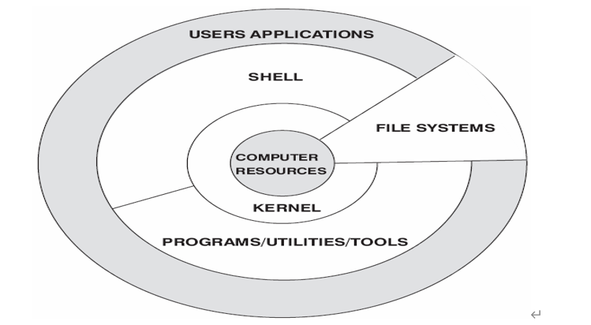

## 1、Linux简介

`Linux` 最初是由芬兰赫尔辛基大学学生 `Linus Torvalds`（林纳斯·托瓦兹）由于自己不满意教学中使用的 `MINIX` 操作系统， 所以在1990年底由于个人爱好设计出了 `LINUX` 系统核心。后来发布于芬兰最大的 `ftp` 服务器上，用户可以免费下载，所以它的周边的程序越来越多，`Linux` 本身也逐渐发展壮大起来，之后 `Linux` 在不到三年的时间里成为了一个功能完善，稳定可靠的操作系统。

 

## 2、Linux特点

开放性，多用户，多任务，丰富的网络功能，可靠的系统安全，良好的可移植性，具有标准兼容性，良好的用户界面（命令界面，图形界面等），出色的速度性能等。

 

## 3、Linux组成

`Computer Resources`：相当于`CPU`、内存、硬盘、打印机等

`Kernel` 内核：是系统的心脏，是运行程序和管理像磁盘和打印机等硬件设备的核心程序。

`Shell`：是系统的用户界面，提供了用户和内核进行交互操作的一种接口。它接收用户输入的命令并把它送入内核去执行，是一个命令解释器。但它不仅是命令解释器，而且还是高级编程语言，`Shell` 编程。

`File System` 文件系统：文件系统是文件存放在磁盘等存储设备上的组织方法，`Linux` 支持多种文件系统，如 `ext3,ext2,NFS,SMB,iso9660` 等

`User Applications` 应用程序：标准的操作系统都会有一套应用程序例如等

 

## 4、Linux目录结构

* `bin` 存放二进制可执行文件( `ls,cat,mkdir` 等)

* `boot` 存放用于系统引导时使用的各种文件

* `dev` 用于存放设备文件

* `etc` 存放系统配置文件

* `home` 存放所有用户文件的根目录

* `lib` 存放跟文件系统中的程序运行所需要的共享库及内核模块

* `mnt` 系统管理员安装临时文件系统的安装点

* `opt` 额外安装的可选应用程序包所放置的位置

* `proc` 虚拟文件系统，存放当前内存的映射

* `root` 超级用户目录

* `sbin` 存放二进制可执行文件，只有 `root` 才能访问

* `tmp` 用于存放各种临时文件

* `usr` 用于存放系统应用程序，比较重要的目录 `/usr/local` 本地管理员软件安装目录

* `var` 用于存放运行时需要改变数据的文件

