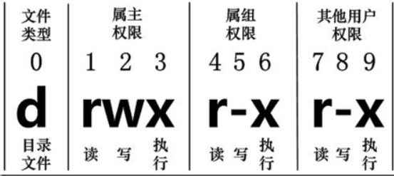

## 1、目录

Linux 的目录结构为树状结构，最顶层为根目录 `/`

<br>

### 1.1、相对路径和绝对路径

**绝对路径：绝对路径由 `/` 开始。**

例如：到 ` /home/admin/looper ` 目录下。命令为：`cd /home/admin/looper ` 

**相对路径：不是从 `/` 开始。**

例如：从 ` /home/admin/looper ` 目录下到 ` /home/admin/wang ` 目录下。命令为：`cd ../wang ` 

<br>

### 1.2、目录常用命令

**ls：列出当前目录下的文件**

* ls -a：列出全部文件，包括隐藏文件
* ls -l：长数据串列出，包括文件的属性和权限
* ls -al：将目录下的所有文件列出来（含属性与隐藏档）

<br>

**cd：切换目录**

* cd 目录名：切换到当前目录下
* cd ..：切换到上一级目录
* cd /：切换到根目录下

<br>

**pwd：显示目前的目录**

* pwd -p：显示当前所在目录

<br>

**mkdir：创建一个新目录**

* mkdir -m 目录名：创建目录，并且为该目录分配权限
* mkdir -p 目录名：创建目录，并且会递归创建所需要的的上级目录
* mkdir -mp 目录名：进行递归创建目录，并未该目录分配权限

<br>

**rmdir：删除一个空目录**

* rmdir -p 目录名：删除空目录，连同上级空目录也会删除

<br>

**rm：移除文件或目录**

* rm -f 目录名：忽略不存在的文件，不会出现警告信息
* rm -i 目录名：删除之前会询问是否删除
* rm -f 目录名：递归删除，最常用在目录的删除，这是非常危险的选项 

<br>

**cp：复制文件或目录**

```
[root@looper ~]# cp [-adfilprsu] source destination
[root@looper ~]# cp [options] source1 source2 source3 .... directory
```

* -a：相当于 -pdr 的意思，至于 pdr 请参考下列说明（常用）
  * -p：连同文件的属性一起复制过去，而非使用默认属性（备份常用）
  * -d：若来源档为连结档的属性 link file，则复制连结档属性而非文件本身
  * -r：递归持续复制，用于目录的复制行为（常用）

* -f：为强制 force 的意思，若目标文件已经存在且无法开启，则移除后再尝试一次
* -i：若目标档 destination 已经存在时，在覆盖时会先询问动作的进行（常用）
* -l：进行硬式连结 hard link 的连结档创建，而非复制文件本身
* -s：复制成为符号连结档 symbolic link，亦即（捷径）文件
* -u：若 destination 比 source 旧才升级 destination（目标）

<br>

**mv：移动文件与目录，或者修改文件名**

```
[root@looper ~]# mv [-fiu] source destination
[root@looper ~]# mv [options] source1 source2 source3 .... directory
```

* mv -fiu source destination：将源文件移动到目标目录下

* -f：若目标文件已经存在，不会询问而直接覆盖
* -i：若目标文件已经存在，会询问是否覆盖
* -u：若目标文件已经存在，且 source 比较新，才会覆盖
* mv oldName newName：给文件重命名

<br>

<br>

## 2、文件

### 2.1、文件属性

Linux 系统是一种典型的多用户，多任务系统，不同的用户处于不同的地位，拥有不同的权限。

为了保护系统的安全性，Linux 系统对不同的用户访问同一文件（包括目录文件）的权限做了不同的规定。

在 Linux 中我们可以使用 `ll` 或者 `ls –l` 命令来显示一个文件的属性以及文件所属的用户和组。


在Linux中第一个字符代表这个文件是目录、文件或链接文件等等

- `d` 则是目录
- `-` 则是文件
- `l` 则表示为链接文档（link file）
- `b` 则表示为装置文件里面的可供储存的接口设备（可随机存取装置）
- `c` 则表示为装置文件里面的串行端口设备，例如键盘、鼠标（一次性读取装置）

接下来的字符中，以三个为一组，且均为 「rwx」 的三个参数的组合（三个权限的位置不会改变）

* `r`：代表可读（read）
* `w`：代表可写（write）
* `x`：代表可执行（execute）
* `-`：代表无权限

每个文件的属性由左边第一部分的 10 个字符来确定（如下图）：



对于文件来说，它都有一个特定的所有者，也就是对该文件具有所有权的用户

同时，在 Linux 系统中，用户是按组分类的，一个用户属于一个或多个组

文件所有者以外的用户又可以分为文件所有者的同组用户和其他用户

因此，Linux系统按文件所有者、文件所有者同组用户和其他用户来规定了不同的文件访问权限

<br>

### 2.2、修改文件属性

**chgrp：更改文件组属性**

* chgrp [-R] 属组名 文件名

  -R：递归更改文件属组（该目录下的所有文件的属组都会更改）

<br>

**chown：更改文件属主，也可以同时更改文件属组**

* chown [-R] 属主名 文件名
* chown [-R] 属主名:属组名 文件名

<br>

**chmod：更改文件9个属性**

* chmod [-R] xyz 文件或目录

Linux 文件属性有两种设置方法，一种是数字，一种是符号

Linux 文件的基本权限就有九个，分别是 owner/group/others 三种身份各有自己的 read/write/execute 权限

<br>

文件的权限字符为「-rwxrwxrwx」，这九个权限是三个三个一组。其中，可以使用数字来代表各个权限，各权限的分数对照表示：r=4、w=2、x=1；每种身份 owner/group/others 各自的三个权限 r/w/x 分数是需要累加的。

例如当权限为：[-rwxrwx---] 分数则是：

- owner = rwx = 4+2+1 = 7
- group = rwx = 4+2+1 = 7
- others = --- = 0+0+0 = 0

则执行的命令为：`chmod 770 filename`

<br>

2.3、文件内容


### 5.2、查看当前网络

`ifconfig`指令 查看`IP`地址；与`Windows`系统中的`DOS`（`ipconfig`）命令不同


----

创建文件：

mkdir 【目录名】：创建一个目录

touch 【文档名】：创建一个新的空文档

echo abcd>【文档名】：创建一个新的内容为“abcd”的txt文档

-------

pwd：查看当前所在的目录

---

查看文档：

cd 【目录名】：切换目录

cd  ..：切换到上级目录

cd /：切换到根目录

ls：查看当前目录的文件夹

* -l：列出文件的详细信息
* -a：列出当前目录的所有文件

cat，tac：查看文件内容


more 文件名：用于显示文件长度超过一个画面长度的情况，空格显示下一个画面，按q退出  


删除文件：

rm：删除文件

-----

shutdown：系统关机

* -r：关机后重启
* -h：关机后不重新启动
* -now：立即关机
* 12:30：指定时间关机

halt：关机后关闭电源

reboot：重新启动

----

VI 编辑器

* 编辑模式


* 插入模式


* 命令模式


----

组：

cat /etc/group：查看分组

groupadd/addgroup：添加分组

groupmod：分组的修改

groupdel：分组的删除


----

用户：

cat /etc/passwd：查看用户

useradd/adduser：添加用户

usermod：用户的修改

userdel：用户的删除


-----

文件压缩和解压缩：

• tar命令文件、目录打（解）包

命令格式：

•   tar [-cxzjvf]  压缩打包文档的名称 欲打包目录

参数：

•   -c ：建立一个归档文件的参数指令

•   -x ：解开一个归档文件的参数指令！

•   -z ：是否需要用 gzip 压缩？s

•   -j ：是否需要用 bzip2 压缩？

•   -v ：压缩的过程中显示文件

•   -f ：使用档名，在 f 之后要立即接档名

•   -tf ：查看归档文件里面的文件

•   最常用压缩    tar -cvf  xxx.tar 文件名1 文件名2

•   最常用解压缩  tar –xvf  xxx.tar(.gz) 目录名


