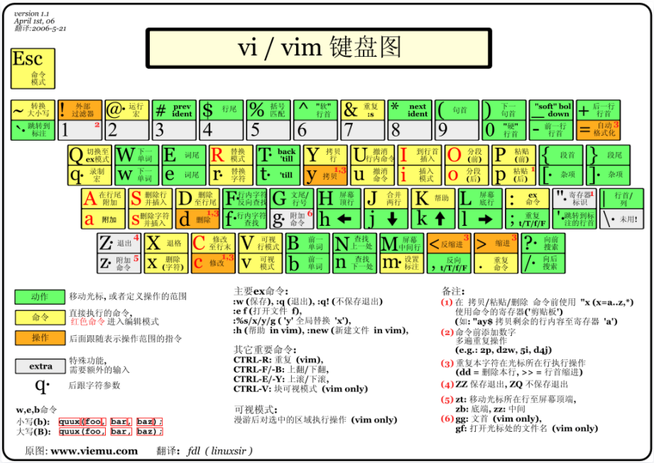

## 1、Vim编辑器

Vim 是从 vi 发展出来的一个文本编辑器

代码补完、编译及错误跳转等方便编程的功能特别丰富，在程序员中被广泛使用

简单的来说， vi 是老式的字处理器，不过功能已经很齐全了，但是还是有可以进步的地方

vim 则可以说是程序开发者的一项很好用的工具

 

### 1.1、Vim三种模式

基本上 vi/vim 共分为三种模式。

分别是：命令模式（Command mode）、输入模式（Insert mode）、底线命令模式（Last line mode）

这三种模式的作用分别是： 

**命令模式（Command mode）**

用户启动 vi/vim，便进入了命令模式。此状态下敲击键盘动作会被 Vim 识别为命令，而非输入字符。比如我们此时按下 `i`，并不会输入一个字符，`i` 被当作了一个命令。

以下是常用的几个命令：

- `i`：切换到输入模式，以输入字符
- `x`：删除当前光标所在处的字符
- `:`：切换到底线命令模式，以在最底一行输入命令

若想要编辑文本：启动 Vim，进入了命令模式，按下 `i`，切换到输入模式，命令模式只有一些最基本的命令，因此仍要依靠底线命令模式输入更多命令。

 

**输入模式（Insert mode）**

在命令模式下按下 `i` 就进入了输入模式。在输入模式中，可以使用以下按键：

- 字符按键以及Shift组合：输入字符
- ENTER：回车键，换行
- BACK SPACE：退格键，删除光标前一个字符
- DEL：删除键，删除光标后一个字符
- 方向键：在文本中移动光标
- HOME/END：移动光标到行首/行尾
- Page Up/Page Down：上/下翻页
- Insert：切换光标为输入/替换模式，光标将变成竖线/下划线
- ESC：退出输入模式，切换到命令模式

 

**底线命令模式（Last line mode）**

在命令模式下按下:（英文冒号）就进入了底线命令模式，底线命令模式可以输入单个或多个字符的命令，可用的命令非常多，在底线命令模式中，基本的命令有（已经省略了冒号）

- q 退出程序
- w 保存文件

按 ESC 键可随时退出底线命令模式。

### 1.2、Vim按键说明

除了上面简易范例的 i, Esc, :wq 之外，其实 vim 还有非常多的按键可以使用

https://linux.cn/article-8144-1.html（Vim速查表）

 

### 1.3、Vim 常用命令

#### 光标移动

`h,j,k,l`：h 表示往左，j 表示往下，k 表示往右，l 表示往上

`Ctrl+f`：上一页

`Ctrl+b`：下一页

`w, e, W, E`：跳到单词的后面，小写包括标点

`b, B：`以单词为单位往前跳动光标，小写包含标点

`O`：开启新的一行

`^`：一行的开始

`$`：一行的结尾

`gg`：文档的第一行

`[N]G`：文档的第N行或者最后一行

 

#### 插入

`i`：插入到光标前面

`I`：插入到行的开始位置

`a`：插入到光标的后面

`A`：插入到行的最后位置

`o, O`：新开一行

`Esc`：关闭插入模式

 

#### 编辑

`r`：在插入模式替换光标所在的一个字符

`J`：合并下一行到上一行

`s`：删除光标所在的一个字符, 光标还在当行

`S`：删除光标所在的一行，光标还在当行，不同于dd

`u`：撤销上一步操作

`ctrl+r`：恢复上一步操作

`.`：重复最后一个命令

`~`：变换为大写

`[N]>>`：一行或N行往右移动一个tab

`[N]<<`：一行或N行往左移动一个tab

 

#### 关闭

`:w`：保存

`:wq, :x`：保存并关闭

`:q`：关闭（已保存）

`:q!`：强制关闭

 

#### 搜索

`/pattern`：搜索（非插入模式)

`?pattern`：往后搜索

`n`：光标到达搜索结果的前一个目标

`N`：光标到达搜索结果的后一个目标

 

#### 视觉

`v`：选中一个或多个字符

`V`：选中一行

 

#### 剪切和复制

`dd`：删除一行

`dw`：删除一个单词

`x`：删除后一个字符

`X`：删除前一个字符

`D`：删除一行最后一个字符

`[N]yy`：复制一行或者N行

`yw`：复制一个单词

`p`：粘贴

 

#### 窗口操作

`:split`：水平方向分割出一个窗口

`:vsplit`：垂直方向分割出一个窗口

`:close`：关闭窗口

`Ctrl+W`：切换窗口，h 到左边窗口，j 到下方窗口，k 到上方窗口，l 到右边窗口

