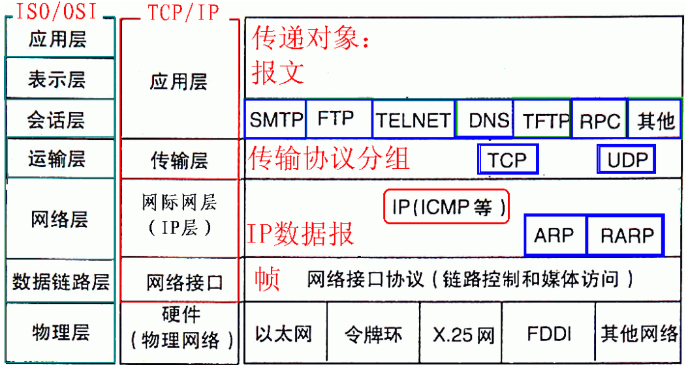

> 计算机网络的核心内容就是网络协议
>
> 网络协议就是为计算机在网络中交换数据所制定的一堆协议（规定）
>
> 计算机网络中的普通话（规定）"TCP/IP"。

 

# 网络分层

为了使不同计算机厂家生产的计算机能够相互通信，以便在更大的范围内建立计算机网络，国际标准化组织（ISO）在1978年提出了"开放系统互联参考模型"，即著名的OSI/RM模型（Open System Interconnection/Reference Model）。

 

## 1.1、OSI七层模型

### OSI（Open System Interconnection）模型

自下而上分层：物理层、数据链路层、网络层、传输层、会话层、表示层、应用层

## 1.2、TCP/IP四层模型

### TCP/IP模型

自下而上分层：网络接口层（物理层、数据链路层）、网络层、传输层、应用层（会话层、表示层应用层）

TCP/IP 协议是互联网的基础协议。

每一层中都有自己的专属协议，完成自己的工作与上下层级之间进行沟通

