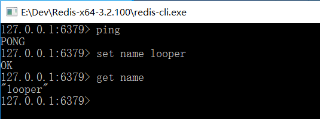

## NoSQL概述

### 1、什么是Redis

Redis（==Re==mote ==Di==ctionary ==S==erver）远程字典服务。 

Redis 是一个开源的使用 C 语言编写、支持网络、可基于内存，也可持久化的日志型、Key-Value数据库，并提供多种语言的API。 是当下最热门的 NoSQL 数据库之一。

读的速度是 10 万次/s,写的速度是 8 万次/s 。 

 

### 2、Redis作用

1. 内存存储（提高效率），持久化（内存中断电即失，需要rdb、aof）
2. 效率高，可以用于高速缓存
3. 发布订阅系统（简单的消息队列）
4. 地图信息分析
5. 计数器，计时器（文章视频浏览量）
6. ...

 

### 3、Redis特性

1. 多样的数据类型
2. 持久化
3. 集群
4. 事务
5. ...

 

### 4、学习Redis刚需

1. Redis官网：https://redis.io/
2. Redis中文网：http://redis.cn/
3. 下载地址：通过官网下载即可
4. Window 系统在 GitHub 上下载

注意：GitHub 上的 Windows 的 Redis 版本已经很久没更新了，官方推荐在 Linux 上安装使用。

 

### 5、Windows下安装Redis

官网：https://redis.io/download

Windows 版下载地址：https://github.com/MicrosoftArchive/redis/releases

下载 Redis For window X64.zip 解压到指定目录

安装完成测试：

 

### 6、Linux下安装Redis

暂待...

 

### 7、Redis性能测试

Redis 性能测试参数：

| 序号 | 选项      | 描述                                       | 默认值    |
| :--- | :-------- | :----------------------------------------- | :-------- |
| 1    | **-h**    | 指定服务器主机名                           | 127.0.0.1 |
| 2    | **-p**    | 指定服务器端口                             | 6379      |
| 3    | **-s**    | 指定服务器 socket                          |           |
| 4    | **-c**    | 指定并发连接数                             | 50        |
| 5    | **-n**    | 指定请求数                                 | 10000     |
| 6    | **-d**    | 以字节的形式指定 SET/GET 值的数据大小      | 2         |
| 7    | **-k**    | 1=keep alive 0=reconnect                   | 1         |
| 8    | **-r**    | SET/GET/INCR 使用随机 key, SADD 使用随机值 |           |
| 9    | **-P**    | 通过管道传输 `<numreq>` 请求               | 1         |
| 10   | **-q**    | 强制退出 redis。仅显示 query/sec 值        |           |
| 11   | **--csv** | 以 CSV 格式输出                            |           |
| 12   | **-l**    | 生成循环，永久执行测试                     |           |
| 13   | **-t**    | 仅运行以逗号分隔的测试命令列表。           |           |
| 14   | **-I**    | Idle 模式。仅打开 N 个 idle 连接并等待。   |           |

测试 Redis 性能：

~~~bash
# 测试 Redis 性能,本机localhost,端口6379,并发数100,请求数100000
redis-benchmark -h localhost -p 6379 -c 100 -n 100000
~~~

测试结果：

【bilibili遇见狂神说】

 

### 8、基本的Redis命令

切换数据库：`select 3`（切换到第四个数据库，默认从 0 开始）

查看数据库大小：`dbsize`

清空当前数据库：`flushdb`

清空所有的数据库：`flushall`

查看所有的 key：`keys *`

 

### 9、Redis是单线程的

Redis是基于内存的，CPU不是Redis性能的瓶颈，**Redis的瓶颈是根据机器的内存（内存大小）和网络的带宽（接受数据）**，既然可以使用单线程来实现，所以就不需要使用多线程。

Redis 是 C 语言写的，官方提供的数据为 10万+ 的 QPS，完全不必同样是使用 key-value 的 Memecache 差。

 

#### Redis 为什么单线程还那么快？

1. 误区1：高性能的服务器一定是多线程的？错，不一定

2. 误区2：多线程一定比单线程效率高？错，不一定，多线程中会产生上下文切换

   CPU > 内存 > 硬盘的速度

核心：Redis 是将所有的数据放到内存中的，所有使用单线程操作效率就是最高的。如果使用多线程，会产生 CPU 的上下文切换，对于内存系统来说，如果，没有上下文切换效率就是最高的，多次读写都在一个 CPU 上的，在内存情况下，这个就是最佳的方案。