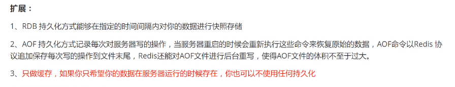
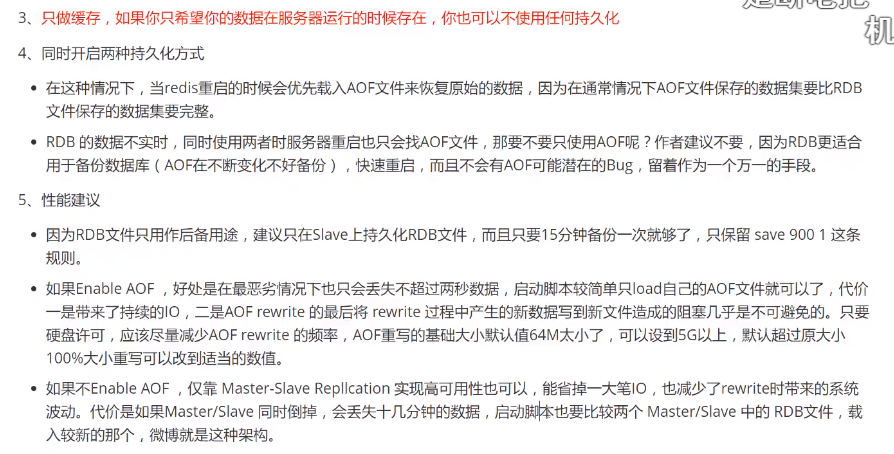

## Redis持久化（重点）

Redis 是内存数据库，如果不将内存中的数据保存到磁盘中，那么服务器一旦出现进程退出或者宕机，服务器内存中的数据也会消失，所以 Redis 提供了持久化的功能。

Redis 提供了两种持久化方案：**RDB持久化**和**AOF持久化**，一个是快照的方式，一个是类似日志追加的方式。

 

### RDB（Redis DataBase）

#### 什么是RDB

在指定的时间间隔内将内存中的数据集通过快照的方式写入磁盘中，也就是对内存中的数据拍快照进行备份。恢复数据时，直接将快照文件读取到内存中。该文件是一个**压缩**过的**二进制文件**。

在创建快照之后，用户可以备份该快照，可以将快照复制到其他服务器以创建相同数据的服务器副本，或者在重启服务器后恢复数据。

RDB 是 Redis 默认的持久化方式 。RDB 文件默认为当前工作目录下的 `dump.rdb`，可以根据配置文件中的 `dbfilename` 和 `dir` 设置 RDB 的文件名和文件位置。

在主从复制中，RDB 就在从机上面备用的，不占主机的内存。

 

#### RDB持久化过程

Redis 会单独创建（fork）一个子进程来进行持久化，会先将数据写入到一个临时文件中，持久化过程结束了，再用这个临时文件替换上次持久化好的文件。整个过程中，主进程不需要任何的 IO 操作，这就确保了 Redis 极高的性能。如果需要大规模的数据恢复，且对于数据恢复的完整性不是非常敏感，那么 RDB 方式要比 AOF 方式更加的高效。RDB的缺点是最后一次持久化的数据可能会丢失。在生产环境中会对 RDB 文件进行备份，防止丢失。

 

#### 触发机制：

1. save 的规则满足的情况下会触发生成 rdb 文件
2. 执行 flushall 命令也会触发生成 rdb 文件
3. 退出 Redis 也会触发生成 rdb 文件

 

#### 恢复RDB文件：

只需要将 rdb 文件放在 Redis 启动目录下即可，Redis 启动的时候会自动检查并恢复数据

 

#### 优点：

1. RDB 快照是一个压缩过的非常紧凑的文件，保存着某个时间点的数据集，适合做数据的备份，灾难恢复（适合大规模的数据恢复）
2. 可以最大化 Redis 的性能，在保存 RDB 文件，服务器进程只需 fork 一个子进程来完成 RDB 文件的创建，父进程不需要做 IO 操作
3. 与 AOF 相比，恢复大数据集的时候会更快

 

#### 缺点：

1. RDB 的数据安全性是不如 AOF 的，保存整个数据集的过程是比繁重的，根据配置可能要几分钟才快照一次，如果服务器宕机，那么就可能丢失几分钟的数据（需要一定的时间间隔进程操作，如果 Redis 意外宕机，最后一次的数据就会丢失）
2. Redis 数据集较大时，fork 的子进程要完成快照会比较耗 CPU、耗时（fork 进程的时候，会占用一定的内存空间）

 

 

### AOF（Append Only File）

#### 什么是AOF

AOF 持久化会把被执行的写命令写到 AOF 文件的末尾，记录数据的变化。

恢复的时候就把这个文件全部执行一遍。（历史记录）

默认情况下，Redis 是没有开启 AOF 持久化的，开启后，每执行一条更改 Redis 数据的命令，都会把该命令追加到 AOF 文件中，这是会降低 Redis 的性能，但大部分情况下这个影响是能够接受的，另外使用较快的硬盘可以提高 AOF 的性能。

 

#### AOP配置文件

~~~bash
# appendonly参数开启AOF持久化
appendonly no

# AOF持久化的文件名，默认是appendonly.aof
appendfilename "appendonly.aof"

# AOF文件的保存位置和RDB文件的位置相同，都是通过dir参数设置的
dir ./

# 同步策略
# appendfsync always
appendfsync everysec
# appendfsync no

# aof重写期间是否同步
no-appendfsync-on-rewrite no

# 重写触发配置
auto-aof-rewrite-percentage 100
auto-aof-rewrite-min-size 64mb

# 加载aof出错如何处理
aof-load-truncated yes

# 文件重写策略
aof-rewrite-incremental-fsync yes
~~~

 

#### AOF持久化过程

以日志的形式来记录每一个写操作，将 Redis 执行过的所有指令记录下来（读操作不记录），只许追加文件但不可以改写文件，Redis 启动之初会读取该文件重新构建数据，换言之，Redis 重启的话就根据日志文件的内容将写指令从前到后执行一次，以完成数据的恢复工作。

 

#### 优点：

1. 数据更完整，安全性更高，秒级数据丢失（取决 fsync 策略，如果是 everysec，最多丢失 1 秒的数据）
2. AOF 文件是一个只进行追加的日志文件，且写入操作是以 Redis 协议的格式保存的，内容是可读的，适合误删紧急恢复

 

#### 缺点：

1. 对于相同的数据集（数据文件），AOF 文件的体积要大于 RDB 文件，数据恢复也会比较慢
2. AOF 运行的效率也要比 RDB 慢，所以 Redis 默认的配置就是 RDB 持久化

 

### 扩展

