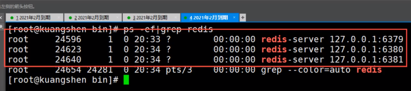

## Redis主从复制

### 概念

主从复制，是指将一台Redis服务器的数据，复制到其他的Redis服务器。前者称为主节点(master)，后者称为从节点(slave)；数据的复制是单向的，只能由主节点到从节点。

默认情况下，每台Redis服务器都是主节点；且一个主节点可以有多个从节点(或没有从节点)，但一个从节点只能有一个主节点。

 

#### 主从复制的作用

1. 数据冗余：主从复制实现了数据的热备份，是持久化之外的一种数据冗余方式。
2. 故障恢复：当主节点出现问题时，可以由从节点提供服务，实现快速的故障恢复；实际上是一种服务的冗余。
3. 负载均衡：在主从复制的基础上，配合读写分离，可以由主节点提供写服务，由从节点提供读服务（即写Redis数据时应用连接主节点，读Redis数据时应用连接从节点），分担服务器负载；尤其是在写少读多的场景下，通过多个从节点分担读负载，可以大大提高Redis服务器的并发量。
4. 高可用基石：除了上述作用以外，主从复制还是哨兵和集群能够实施的基础，因此说主从复制是Redis高可用的基础。

 

#### 环境配置

只配置从库不用配置主库。

需要注意，**主从复制的开启，完全是在从节点发起的；不需要我们在主节点做任何事情。**

从节点开启主从复制，有3种方式：

1、配置文件（永久的）

在从服务器的配置文件中加入：`slaveof <masterip> <masterport>`

2、启动命令

redis-server 启动命令后加入：`--slaveof <masterip> <masterport>`

3、客户端命令（暂时的）

Redis 服务器启动后，直接通过客户端执行命令：`slaveof <masterip> <masterport>`，则该  Redis 实例成为从节点。

~~~bash
127.0.0.1:6379> info replication  #查看当前库的信息
# Replication
role:master                       #主机
connected_slaves:0                #从机为0
master_repl_offset:0
repl_backlog_active:0
repl_backlog_size:1048576
repl_backlog_first_byte_offset:0
repl_backlog_histlen:0
127.0.0.1:6379>
~~~

复制 3 个配置文件，然后修改对应的信息

1. 端口
2. pid 名字
3. log 文件名
4. dump.rdb 文件名

启动服务

 

#### 注意

1. 主机可以有多个从机，但是一个从机只能有一个主机。
2. 主机可以读写，但是从机只能读不能写。
3. 主机断开连接，从机依旧连接到主机的，任然是从机，只有读操作，没有写操作；如果主机恢复了，从机依旧可以直接获取到主机写入的信息。
4. 如果从机使用命令行配置的主从，断开连接后，再次连接会成为主机；如果将该机再次设置为从机，数据会立马从主机获取。

 

#### 复制原理

slave 启动成功连接到 master 后，会发送一个 sync 同步命令

master 接收到命令，启动后台的存盘进程，同时收集所有接收到的用于修改数据集命令在后台进程执行完毕之后，master 将传送整个文件到 slave，完成一次完全同步

> 全量复制：而 slave 服务在接收到数据库文件数据后，将其直接存盘并加载到内存中
>
> 增量复制：master 继续将新的所有的收集到的修改命令依次传给 slave，完成同步

但是只要是重新连接 master，一次完全同步（全量复制）将被自动执行

 

#### 谋权篡位

如果主机断开了连接，我们可以使用 `slaveof no one` 让自己变成主机！其他节点就可以手动连接到最新的这个主节点（手动）！如果之前断开连接的主机修复了，那就重新连接。