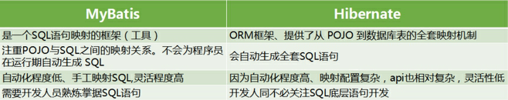

## 1、MyBatis

### 1.1、什么是MyBatis

MyBatis 是一款优秀、开源的持久层框架，它支持自定义 SQL、存储过程以及高级映射。

MyBatis 几乎免除了所有的 JDBC 代码，以及设置参数和获取结果集的工作。

MyBatis 可以通过简单的 XML 或注解来配置和映射原始类型、接口和 Java POJO（Plain Old Java Objects，普通老式 Java 对象）为数据库中的记录。

  

### 1.2、mybatis优点

1. 基于 SQL 语法，简单易学
2. 能了解底层组装过程
3. SQL 语句封装在配置文件中，便于统一管理与维护，降低了程序的耦合度
4. 程序调试方便

  

### 1.3、MyBatis和JDBC的区别

1. 减少了大量的代码
2. 最简单的持久化框架
3. 架构级性能增强
4. SQL 代码从程序中彻底分离，可以重用
5. 增强了项目中的分工
6. 增强了可移植性

 

#### 1.4、MyBatis和Hibernate的区别

  

### 1.5、ORM

ORM（Object Relation Mapping）关系对象映射：是指 Java 类对象与数据库表的对应关系，数据库表的一条记录代表一个 Java 对象

 

 

## 2、mybatis快速入门

[mybatis 官网](https://mybatis.org/mybatis-3/zh/getting-started.html)

### 2.1、创建工程

创建一个 Maven 的 jar 工程

 

### 2.2、配置依赖

在 pom.xml 添加 mybatis、mysql、junit 的 jar 依赖

~~~xml
<dependency>
    <groupId>junit</groupId>
    <artifactId>junit</artifactId>
    <version>4.12</version>
</dependency>
<dependency>
    <groupId>org.mybatis</groupId>
    <artifactId>mybatis</artifactId>
    <version>3.5.3</version>
</dependency>
<dependency>
    <groupId>mysql</groupId>
    <artifactId>mysql-connector-java</artifactId>
    <version>5.1.46</version>
</dependency>
~~~

 

### 2.3、MyBatis配置文件

### 在 `main/src/resource` 创建配置文件 `mybatis.xml`

~~~xml
<?xml version="1.0" encoding="UTF-8"?>
<!DOCTYPE configuration
PUBLIC "-//mybatis.org//DTD Config 3.0//EN"
"http://mybatis.org/dtd/mybatis-3-config.dtd">
<configuration>
	<environments default="development">
		<environment id="development">
		<transactionManager type="JDBC"/>
		<dataSource type="POOLED">
				<property name="driver" value="com.mysql.jdbc.Driver"/>
				<property name="url" value="jdbc:mysql:///test02"/>
				<property name="username" value="root"/>
				<property name="password" value="123looper."/>
			</dataSource>
		</environment>
	</environments>
	<mappers>
		<mapper resource="com/tjetc/domain/studentMapper.xml"/>
	</mappers>
</configuration>
~~~

 

### 2.4、实体类

创建一个实体类，实体类中的属性与数据库表中的字段应该相对应

~~~java
public class Student {
	private int id;
	private String name;
	private int age;
}
~~~

 

### 2.5、SQL配置文件

在该实体类同文件下创建 `studentMapper.xml` 配置文件

~~~xml
<?xml version="1.0" encoding="UTF-8"?>
<!DOCTYPE mapper
PUBLIC "-//mybatis.org//DTD Mapper 3.0//EN"
"http://mybatis.org/dtd/mybatis-3-mapper.dtd">
<mapper namespace="test">
    <!-- 添加一条记录操作 -->
	<insert id="add" parameterType="com.tjetc.domain.Student">
		insert into student(name,age) values(#{name},#{age})
	</insert>
</mapper>
~~~

 

### 2.6、测试

~~~java
public class StudentTest {
	private static SqlSessionFactory factory;
	static{
		try {
			factory = new SqlSessionFactoryBuilder().build(Resources.getResourceAsReader("mybatis.xml"));
		} catch (IOException e) {
			// TODO Auto-generated catch block
			e.printStackTrace();
		}
	}

	@Test
	public void testAdd() {
		SqlSession session = factory.openSession();
		Student student = new Student("zs",20);
		int i = session.insert("test.add",student);
		session.commit();
		session.close();
		System.out.println("ok...");
	}
	@Test
	public void testUpdate() {
		SqlSession session = factory.openSession();
		Student student = new Student(1,"zs2",22);
		int i = session.update("test.update",student);
		System.out.println(i);
		session.commit();
		session.close();
		System.out.println("ok...");
	}
	@Test
	public void testDel() {
		SqlSession session = factory.openSession();
		int i = session.delete("test.del", 1);
		System.out.println(i);
		session.commit();
		session.close();
		System.out.println("ok...");
	}
	@Test
	public void testList() {
		SqlSession session = factory.openSession();
		List<Student> list = session.selectList("test.list");
		for (Student student : list) {
			System.out.println(student);
		}
		session.close();
		System.out.println("ok...");
	}
	@Test
	public void testGet() {
		SqlSession session = factory.openSession();
		Student student = session.selectOne("test.get", 2);
		System.out.println(student);
		session.close();
		System.out.println("ok...");
	}
}
~~~

