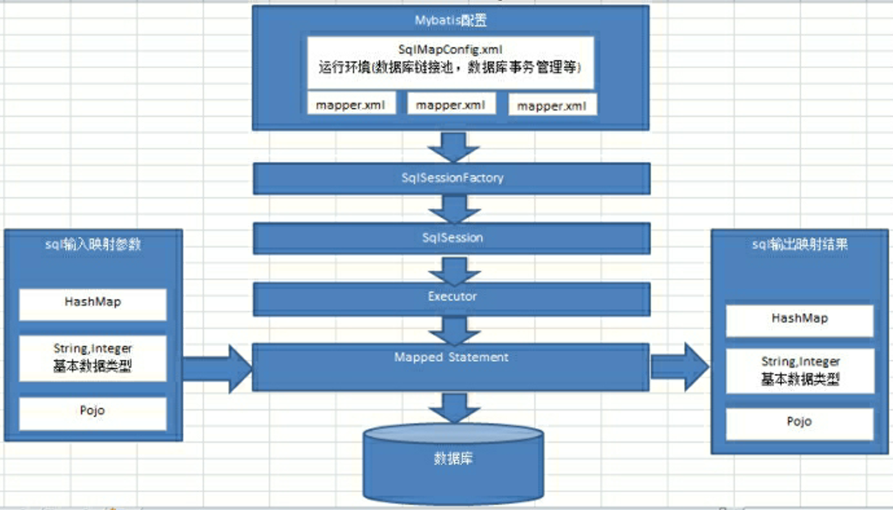

## 1、MyBatis架构

  

### 1.1、mybatis的入参类型

* HashMap

* String、Intege、基本数据类型

* POJO（Plain Old Java Object）

 

### 1.2、mybatis的出参类型

* HashMap

* String、Intege、基本数据类型

* POJO（Plain Old Java Object）

 

### 1.3、流程

1. MyBatis配置

`mybatisConfig.xml`：该文件为 mybatis 的全局配置文件，配置了 mybatis 运行环境等信息。

`mapper.xml`：该文件为 sql 映射文件，文件中配置了操作数据库的 sql 语句，该文件需要在 `mybatisConfig.xml` 中加载。

2. 通过 mybatis 环境等配置信息构造 SqlSessionFactory（会话工厂）

3. 由会话工厂创建 sqlSession（会话），需要通过 sqlSession 操作数据库。

4. 通过 Executor（负责动态 SQL 的生成和查询缓存的维护）将 MappedStatement 对象进行解析，sql 参数转化、动态 sql 拼接，生成 Jdbc Statement 对象等。

5. Mapped Statement 也是 mybatis 一个底层封装对象，它包装了mybatis 配置信息及 sql 映射信息等。mapper.xml 文件中一个 sql 对应一个 Mapped Statement 对象，sql 的 id 即是 Mapped statement 的 id，当 API 接口层接收到调用请求时，会接收到传入 SQL 的 ID 和传入对象（可以是 Map、JavaBean 或者基本数据类型），Mybatis 会根据 SQL 的 ID 找到对应的 MappedStatement，然后根据传入参数对象对MappedStatement 进行解析，解析后可以得到最终要执行的 SQL 语句和参数。

6. Mapped Statement 对 sql 执行输入参数进行定义，包括 HashMap、基本类型、pojo，Executor 通过 Mapped Statement 在执行 sql 前将输入的 Java 对象映射至 sql 中，输入参数映射就是 Jdbc 编程中对 preparedStatement 设置参数。

7. Mapped Statement 对 sql 执行输出结果进行定义，包括 HashMap、基本类型、pojo，Executor 通过 Mapped Statement 在执行 sql 后将将操作数据库的结果按照映射的配置进行转换，可以转换成 HashMap、JavaBean 或者基本数据类型，并将最终结果返回，输出结果映射过程相当于 Jdbc 编程中对结果的解析处理过程。

 

 

 

### 6、MyBatis的Mapper动态代理

#### 6.1、原理

Mapper 接口开发方法只需要程序员编写 Mapper 接口（相当于 Dao 接口），由 MyBatis 框架根据接口定义创建接口的动态代理对象，代理对象的方法体和上边 Dao 接口实现类方法体相同

* MyBatis 的 Mapper 接口动态代理实现原理：
  1. 之前：Dao 接口的 DaoImpl 实现类
  2. MyBatis：Mapper 接口（等价于 Dao 接口）MyBatis 自动生成 Mapper 接口的实现类代理对象（MyBatis 框架自动生成实现类代理对象，不用程序员手写实现类了）

 

#### 6.2、规范4+2

Mapper 接口开发必须遵循以下规范：

1. `mapper.xml` 文件中的 namespace 与 Mapper 接口的类路径相同
2. Mapper 接口的方法名和 `mapper.xml` 中定义的每个 statement 的 id 相同
3. Mapper 接口的方法的输入参数类型和 `mapper.xml` 中定义的每个 sql 的 parameterType 的类型相同
4. Mapper 接口的方法的输出参数类型和 `mapper.xml` 中定义的每个 sql 的 resultType 的类型相同

* 要求 Mapper 接口名称和 mapper 映射文件名称相同
* 要求 Mapper 接口名称和 mapper 映射文件放在同一个目录中

 

 

#### 6.3、步骤

 

 

### 7、注解配置sql

#### 7.1、概念：

把 sql 语句写在接口的方法上方的对应的注解里

`@Insert("insert into ...")`

`@Update("update ...")`

`@Delete("delete from ...")`

`@Select("select ...")`

**注意：映射配置文件可以空，也可以不写**

 

#### 7.2、案例：

~~~java
public interface StudentMapper {

	@Delete("delete from student where id=#{id}")
	void del(int id);
	
	@Select("select * from student")
	List<Student> list();
	
}
~~~

 

 

### 8、MyBatis分页插件

~~~java
@Test
public void getStudents() {
    SqlSession session = factory.openSession();
    PageHelper.startPage(2,2);//当前页，每页显示的条数
    StudentMapper mapper = session.getMapper(StudentMapper.class);
    List<Student> students = mapper.list();
    PageInfo<Student> pageInfo = new PageInfo<>(students);

    //获取分页列表数据
    System.out.println(pageInfo.getList());
    for (Student student : pageInfo.getList()) {
        System.out.println(student);
    }
    //获取上一页
    System.out.println("上一页:"+pageInfo.getPrePage());
    //获取下一页
    System.out.println("下一页:"+pageInfo.getNextPage());
    //获取当前页
    System.out.println("当前页:"+pageInfo.getPageNum());
    //获取总页数
    System.out.println("总页数:"+pageInfo.getPageSize());

    for (Student student : students) {
        System.out.println(student);
    }
    session.commit();
    session.close();
}
~~~

 

 

### 9、MyBatis工作原理

#### 9.1、SqlSession与Connection关系

1. SqlSession 包装了 JDBC 的 Connection，Statement，PreparedStatement，ResultSet 接口

2. SqlSession 含有方法：
   * `Configuration getConfiguration()`：所有 mybatis 的核心配置信息和映射配置信息的读取
   * `<T> T getMapper(Class<T> type)`：对 JDBC 更高级简单封装
   * `Connection getConnection()`：包装了底层的 Connection 对象
   * 常见的数据库的增删改查方法

3. DefaultSqlSession：是 SqlSession 接口的默认实现，含有 SqlSession 的方法
4. BaseExceutor：封装了对 Connection 的管理
5. Transaction：数据库的 Connection 从 dataSource 中获取，并用 Transaction 包装

 

#### 9.2、SqlSession与getMapper实现原理

MyBatis 采用 JDK 动态代理生成 Mapper 接口的代理对象

`StudentMapper mapper = session.getMapper(StudentMapper.class);`

`List<Student> list = mapper.list();//在此处打断点`

断点观察 SqlSession -->> configuration -->> mappedStatements（映射文件中的 sql 读取后，都存于此处）

MyBatis 中映射文件的 sql 读取后，存于 mappedStatements 中，他的数据结构为 StrictMap 

StrictMap 与 HashMap 的不同

StrictMap 第一次 put 进去之后，第二次 put 时，如果 key 值有相同的就会报错

（）

 

### 10、核心配置文件

MyBatis 的核心配置文件配置了 MyBatis 的一些全局信息，包含数据库连接信息和 MyBatis 运行时所需的各种特性，以及设置和影响 MyBatis 行为的一些属性。

所有元素都配置在 `<configuration></configuration>` 根下，configuration 元素是整个XML 配置文件的根结点

注意元素的配置顺序该配置文件的元素节点是有先后顺序的，如下

1. configuration：配置

2. properties：可以配置在Java属性配置文件中

3. settings：修改MyBatis在运行时的行为方式

4. typeAliases：为 Java 类命名一个别名（简称）

5. typeHandlers：类型处理器

6. objectFactory：对象工厂

7. plugins：插件

8. environments：环境
   * transactionManager：事务管理器
   * dataSource：数据源

9. mappers：映射器

 

#### 10.1、properties属性配置：方式一

1. 在 `src/main/resources ` 下创建一个 `db.properties` 文件

~~~properties
jdbc.driver=com.mysql.jdbc.Driver
jdbc.url=jdbc:mysql:///test02
jdbc.username=root
jdbc.password=123looper.
~~~

2. 在 `src/main/resources ` 下的 `mybatis.xml` 中使用 `${}` 的方式获取值

~~~xml
<!DOCTYPE configuration
  PUBLIC "-//mybatis.org//DTD Config 3.0//EN"
  "http://mybatis.org/dtd/mybatis-3-config.dtd">
<configuration>
    
	<properties resource="db.properties"></properties>
    
	<environments default="development">
		<environment id="development">
			<transactionManager type="JDBC" />
			<dataSource type="POOLED">
				<property name="driver" value="${jdbc.driver}" />
				<property name="url" value="${jdbc.url}" />
				<property name="username" value="${jdbc.username}" />
				<property name="password" value="${jdbc.password}" />
			</dataSource>
		</environment>
	</environments>
	<mappers>
		<package name="com.tjetc.dao"></package>
	</mappers>
</configuration>
~~~

 

#### 10.1、properties属性配置：方式二

* 在 `src/main/resources ` 下的 `mybatis.xml` 中，将数据源配置在 properties 节点下，使用 `${}` 的方式获取值

~~~xml
<!DOCTYPE configuration
  PUBLIC "-//mybatis.org//DTD Config 3.0//EN"
  "http://mybatis.org/dtd/mybatis-3-config.dtd">
<configuration>
    
	<properties>
		<property name="jdbc.driver" value="com.mysql.jdbc.Driver" />
		<property name="jdbc.url"
			value="jdbc:mysql:///test02" />
		<property name="jdbc.username" value="root" />
		<property name="jdbc.password" value="123looper." />
	</properties>
    
	<environments default="development">
		<environment id="development">
			<transactionManager type="JDBC" />
			<dataSource type="POOLED">
				<property name="driver" value="${jdbc.driver}" />
				<property name="url" value="${jdbc.url}" />
				<property name="username" value="${jdbc.username}" />
				<property name="password" value="${jdbc.password}" />
			</dataSource>
		</environment>
	</environments>
	<mappers>
		<package name="com.tjetc.dao"></package>
	</mappers>
</configuration>
~~~

 

 

### 11、setting设置

1. settings 用于设置和改变 MyBatis 运行中的行为

2. 如果对属性特征不熟悉，尽量使用默认值 对于 setting 的配置，当需要用到的时候可以查看帮助文档

3. setting 经常用来配置缓存、延迟加载和分页设置

 

 

### 12、别名

#### 12.1、内建的别名

1. 基本类型别名：在基本类型前加 `_`

2. 包装类型：把单词的首字母变小写

 

#### 12.2、通过代码得到别名

~~~java
@Test
public void testAliases() {
    SqlSession session = factory.openSession();
    Configuration configuration = session.getConfiguration();
    TypeAliasRegistry registry = configuration.getTypeAliasRegistry();
    Map<String, Class<?>> map = registry.getTypeAliases();
    Set<String> keySet = map.keySet();
    for (String key : keySet) {
        System.out.println(key+"=====>"+map.get(key).getSimpleName());
    }
    session.close();
    System.out.println("ok...");
}
~~~

结果：（仅展示了部分）

~~~
date=====>Date
_boolean=====>boolean
cglib=====>CglibProxyFactory
_byte[]=====>byte[]
_int[]=====>int[]
object[]=====>Object[]
decimal[]=====>BigDecimal[]
integer=====>Integer
float=====>Float
perpetual=====>PerpetualCache
~~~

 

#### 12.3、自定义别名

1. 单个别名

语法：`<typeAlias alias="user" type="com.tjetc.pojo.User"/>`

步骤：

* 配置

~~~xml
<typeAliases>
    <!--- <typeAlias alias="别名" type="包名+类名"></typeAlias> -->
    <typeAlias alias="student" type="com.tjetc.domain.Student"></typeAlias>
</typeAliases>
~~~

* 在 StudentMapper.xml 使用

~~~xml
<!DOCTYPE mapper
  PUBLIC "-//mybatis.org//DTD Mapper 3.0//EN"
  "http://mybatis.org/dtd/mybatis-3-mapper.dtd">
<mapper namespace="com.tjetc.dao.StudentMapper">
	<select id="list" resultType="student">
		select * from student
	</select>
</mapper>
~~~

 

2. 批量起别名

批量别名定义，扫描整个包下的类，别名为类名（首字母大写或小写都可以）

语法：`<package name="com.tjetc.pojo"/>`

包下的所有类用类名，使用和单个别名一样

~~~xml
<typeAliases>
    <package name="com.tjetc.domain"></package>
</typeAliases>
~~~

