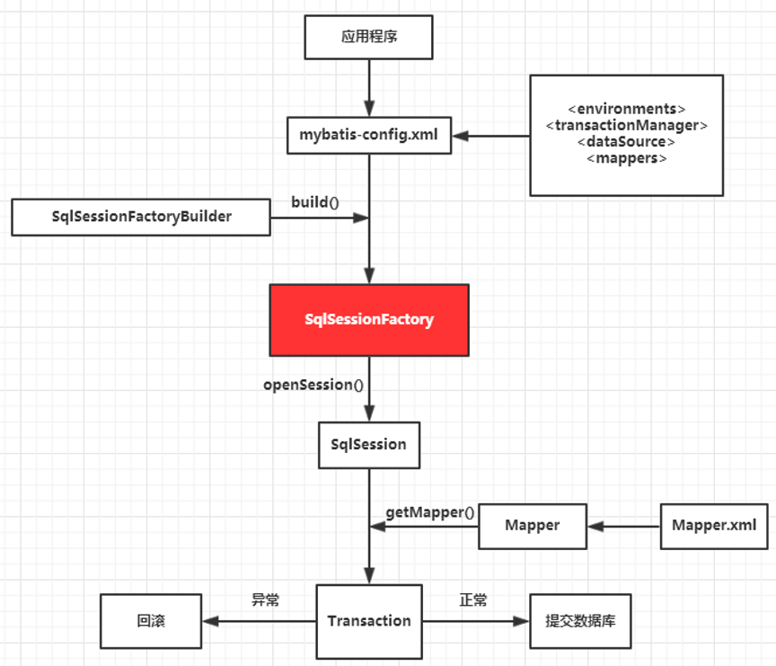

## 1、MyBatis架构

  

### 1.1、mybatis的入参类型

* HashMap

* String、Intege、基本数据类型

* POJO（Plain Old Java Object）

 

### 1.2、mybatis的出参类型

* HashMap

* String、Intege、基本数据类型

* POJO（Plain Old Java Object）

 

### 1.3、流程

1. MyBatis配置

`mybatisConfig.xml`：该文件为 mybatis 的全局配置文件，配置了 mybatis 运行环境等信息。

`mapper.xml`：该文件为 sql 映射文件，文件中配置了操作数据库的 sql 语句，该文件需要在 `mybatisConfig.xml` 中加载。

2. 通过 mybatis 环境等配置信息构造 SqlSessionFactory（会话工厂）

3. 由会话工厂创建 sqlSession（会话），需要通过 sqlSession 操作数据库。

4. 通过 Executor（负责动态 SQL 的生成和查询缓存的维护）将 MappedStatement 对象进行解析，sql 参数转化、动态 sql 拼接，生成 Jdbc Statement 对象等。

5. Mapped Statement 也是 mybatis 一个底层封装对象，它包装了mybatis 配置信息及 sql 映射信息等。mapper.xml 文件中一个 sql 对应一个 Mapped Statement 对象，sql 的 id 即是 Mapped statement 的 id，当 API 接口层接收到调用请求时，会接收到传入 SQL 的 ID 和传入对象（可以是 Map、JavaBean 或者基本数据类型），Mybatis 会根据 SQL 的 ID 找到对应的 MappedStatement，然后根据传入参数对象对MappedStatement 进行解析，解析后可以得到最终要执行的 SQL 语句和参数。

6. Mapped Statement 对 sql 执行输入参数进行定义，包括 HashMap、基本类型、pojo，Executor 通过 Mapped Statement 在执行 sql 前将输入的 Java 对象映射至 sql 中，输入参数映射就是 Jdbc 编程中对 preparedStatement 设置参数。

7. Mapped Statement 对 sql 执行输出结果进行定义，包括 HashMap、基本类型、pojo，Executor 通过 Mapped Statement 在执行 sql 后将将操作数据库的结果按照映射的配置进行转换，可以转换成 HashMap、JavaBean 或者基本数据类型，并将最终结果返回，输出结果映射过程相当于 Jdbc 编程中对结果的解析处理过程。

 

 

## 2、MyBatis工作原理

 

### 2.1、SqlSession与Connection关系

1. SqlSession 包装了 JDBC 的 Connection，Statement，PreparedStatement，ResultSet 接口

2. SqlSession 含有方法：
   * `Configuration getConfiguration()`：所有 mybatis 的核心配置信息和映射配置信息的读取
   * `<T> T getMapper(Class<T> type)`：对 JDBC 更高级简单封装
   * `Connection getConnection()`：包装了底层的 Connection 对象
   * 常见的数据库的增删改查方法

3. DefaultSqlSession：是 SqlSession 接口的默认实现，含有 SqlSession 的方法
4. BaseExceutor：封装了对 Connection 的管理
5. Transaction：数据库的 Connection 从 dataSource 中获取，并用 Transaction 包装

 

### 2.2、SqlSession与getMapper实现原理

MyBatis 采用 JDK 动态代理生成 Mapper 接口的代理对象

`StudentMapper mapper = session.getMapper(StudentMapper.class);`

 

 

## 3、MyBatis的Mapper动态代理

### 3.1、原理

Mapper 接口开发方法只需要程序员编写 Mapper 接口（相当于 Dao 接口），由 MyBatis 框架根据接口定义创建接口的动态代理对象，代理对象的方法体和上边 Dao 接口实现类方法体相同

MyBatis 的 Mapper 接口动态代理实现与 Dao 接口实现 DaoImpl 比较：
1. 原生 JDBC： Dao 接口的 DaoImpl 实现类
2. MyBatis：Mapper 接口（等价于 Dao 接口）MyBatis 自动生成 Mapper 接口的实现类代理对象（MyBatis 框架自动生成实现类代理对象，不用程序员手写实现类了）

 

### 3.2、4+2规范

Mapper 接口开发必须遵循以下规范：

1. `mapper.xml` 文件中的 namespace 与 Mapper 接口的类路径相同
2. Mapper 接口的方法名和 `mapper.xml` 中定义的每个 statement 的 id 相同
3. Mapper 接口的方法参数类型和 `mapper.xml` 中定义的每个 sql 的 parameterType 的类型相同
4. Mapper 接口的方法返回值类型和 `mapper.xml` 中定义的每个 sql 的 resultType 的类型相同

* 要求 Mapper 接口名称和 `mapper.xml` 映射文件名称相同
* 要求 Mapper 接口名称和 `mapper.xml` 映射文件放在同一个目录中
