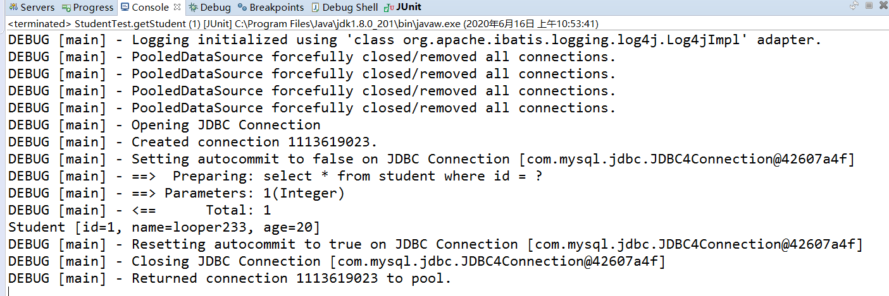

### 1、MyBatis和JDBC的区别

1. 减少了大量的代码
2. 最简单的持久化框架
3. 架构级性能增强
4. SQL 代码从程序中彻底分离，可以重用
5. 增强了项目中的分工
6. 增强了一移植性

 

 

### 2、MyBatis和Hibernate的区别

| MyBatis         | Hibernate |
| --------------- | --------- |
| 是一个 SQL 语句 |           |
|                 |           |
|                 |           |
|                 |           |

 

 

### 3、ORM

ORM（Object Relation Mapping）关系对象映射：是指 Java 类对象与数据库表的对应关系，数据库表的一条记录代表一个 Java 对象

 

 

### 4、MyBatis架构

 

#### 4.1、mybatis的入参类型

* HashMap

* String、Intege、基本数据类型

* POJO（Plain Old Java Object）

 

#### 4.2、mybatis的出参类型

* HashMap

* String、Intege、基本数据类型

* POJO（Plain Old Java Object）

 

1. MyBatis配置

`mybatis.xml` 该文件为 mybatis 的全局配置文件，配置了 mybatis 运行环境等信息。

`studentMapper` 该文件为 sql 映射文件，文件中配置了操作数据库的 sql 语句，该文件需要在`mybatis.xml` 中加载。

2. 通过 mybatis 环境等配置信息构造 SqlSessionFactory 即会话工厂

 

 

### 5、控制台显示sql语句

1. 在 `pom.xml` 中引入 `log4j` 的 `jar` 包

2. 配置文件 `log4j.properties`

~~~properties
log4j.rootLogger=DEBUG, stdout
log4j.logger.org.mybatis.example.BlogMapper=TRACE
log4j.appender.stdout=org.apache.log4j.ConsoleAppender
log4j.appender.stdout.layout=org.apache.log4j.PatternLayout
log4j.appender.stdout.layout.ConversionPattern=%5p [%t] - %m%n
~~~

3. 运行测试类

~~~java
@Test
public void getStudent() {
	SqlSession session = factory.openSession();
    Student student = session.selectOne("test.select",1);
    System.out.println(student);
    session.commit();
    session.close();
}
~~~

4. 控制台显示信息

 

 

### 6、MyBatis的Mapper动态代理

#### 6.1、原理

Mapper 接口开发方法只需要程序员编写 Mapper 接口（相当于 Dao 接口），由 MyBatis 框架根据接口定义创建接口的动态代理对象，代理对象的方法体和上边 Dao 接口实现类方法体相同

* MyBatis 的 Mapper 接口动态代理实现原理：
  1. 之前：Dao 接口的 DaoImpl 实现类
  2. MyBatis：Mapper 接口（等价于 Dao 接口）MyBatis 自动生成 Mapper 接口的实现类代理对象（MyBatis 框架自动生成实现类代理对象，不用程序员手写实现类了）

 

#### 6.2、规范

Mapper 接口开发必须遵循以下规范：

1. `mapper.xml` 文件中的 namespace 与 Mapper 接口的类路径相同
2. Mapper 接口的方法名和 `mapper.xml` 中定义的每个 statement 的 id 相同

3. Mapper 接口的方法的输入参数类型和 `mapper.xml` 中定义的每个 sql 的 parameterType 的类型相同
4. Mapper 接口的方法的输出参数类型和 `mapper.xml` 中定义的每个 sql 的 resultType 的类型相同

 

#### 6.3、步骤

 

 

### 7、注解配置sql

 

 

### 8、MyBatis分页插件

~~~java
@Test
public void getStudents() {
    SqlSession session = factory.openSession();
    PageHelper.startPage(2,2);//当前页，每页显示的条数
    StudentMapper mapper = session.getMapper(StudentMapper.class);
    List<Student> students = mapper.list();
    PageInfo<Student> pageInfo = new PageInfo<>(students);

    //获取分页列表数据
    System.out.println(pageInfo.getList());
    for (Student student : pageInfo.getList()) {
        System.out.println(student);
    }
    //获取上一页
    System.out.println("上一页:"+pageInfo.getPrePage());
    //获取下一页
    System.out.println("下一页:"+pageInfo.getNextPage());
    //获取当前页
    System.out.println("当前页:"+pageInfo.getPageNum());
    //获取总页数
    System.out.println("总页数:"+pageInfo.getPageSize());

    for (Student student : students) {
        System.out.println(student);
    }
    session.commit();
    session.close();
}
~~~

 

 

### 9、MyBatis工作原理

#### 9.1、SqlSession与Connection关系

1. SqlSession 包装了 JDBC 的 Connection，Statement，PreparedStatement，ResultSet 接口

2. SqlSession 含有方法：
   * `Configuration getConfiguration()`：所有 mybatis 的核心配置信息和映射配置信息的读取
   * `<T> T getMapper(Class<T> type)`：对 JDBC 更高级简单封装
   * `Connection getConnection()`：包装了底层的 Connection 对象
   * 常见的数据库的增删改查方法

3. DefaultSqlSession：是 SqlSession 接口的默认实现，含有 SqlSession 的方法
4. BaseExceutor：封装了对 Connection 的管理
5. Transaction：数据库的 Connection 从 dataSource 中获取，并用 Transaction 包装

 

#### 9.2、SqlSession与getMapper实现原理

MyBatis 采用 JDK 动态代理生成 Mapper 接口的代理对象

`StudentMapper mapper = session.getMapper(StudentMapper.class);`

 

### 10、核心配置文件

#### 10.1、properties属性配置

1. 在 `src/main/resources ` 下创建一个 `db.properties` 文件

~~~properties
jdbc.driver=com.mysql.jdbc.Driver
jdbc.url=jdbc:mysql:///test02
jdbc.username=root
jdbc.password=123looper.
~~~

2. 在 `src/main/resources ` 下的 `mybatis.xml` 中使用 `${}` 的方式获取值

~~~xml
<?xml version="1.0" encoding="UTF-8"?>
<!DOCTYPE configuration
  PUBLIC "-//mybatis.org//DTD Config 3.0//EN"
  "http://mybatis.org/dtd/mybatis-3-config.dtd">
<configuration>
	
	<properties resource="db.properties"></properties>
	
	<plugins>
        <!-- com.github.pagehelper为PageHelper类所在包名  -->
    	<plugin interceptor="com.github.pagehelper.PageInterceptor">
        	<!-- 什么都不配，使用默认的配置  -->
    	</plugin>
  	</plugins>
	<environments default="development">
		<environment id="development">
			<transactionManager type="JDBC" />
			<dataSource type="POOLED">
				<property name="driver" value="${jdbc.driver}" />
				<property name="url" value="${jdbc.url}" />
				<property name="username" value="${jdbc.username}" />
				<property name="password" value="${jdbc.password}" />
			</dataSource>
		</environment>
	</environments>
	<mappers>
		<!-- <mapper class="com.tjetc.dao.StudentMapper"/> -->
		<package name="com.tjetc.dao"></package>
	</mappers>
</configuration>
~~~

### 11、setting设置

### 12、别名

#### 12.1、内建的别名

#### 12.2、通过代码得到别名

#### 12.3、自定义别名

1. 单个别名

在 

~~~xml
<typeAliases>
    <!--- <typeAlias alias="别名" type="包名+类名"></typeAlias> -->
    <typeAlias alias="student" type="com.tjetc.domain.Student"></typeAlias>
</typeAliases>
~~~

使用

2. 批量起别名

包下的所有类用类名

~~~xml
<typeAliases>
    <package name="com.tjetc.domain"></package>
</typeAliases>
~~~

