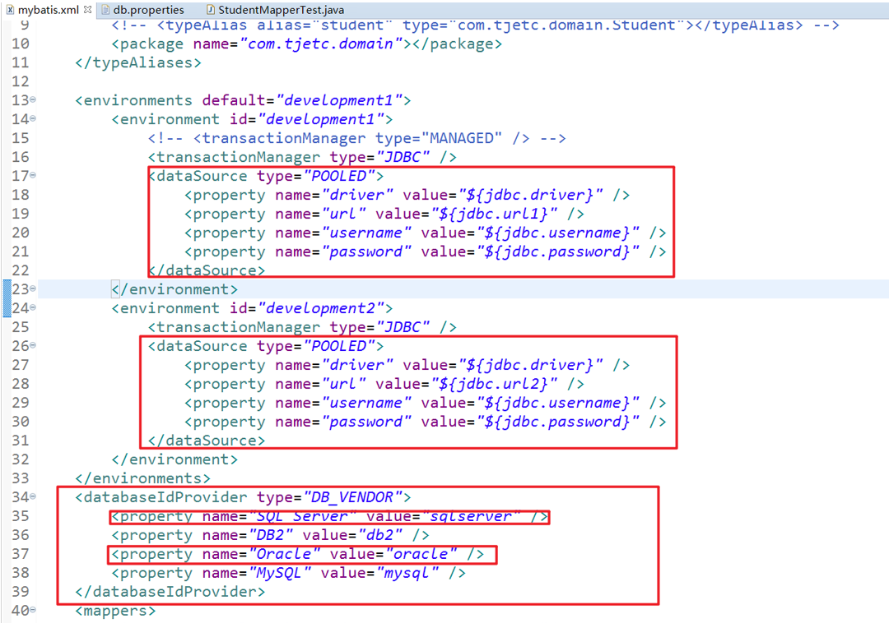
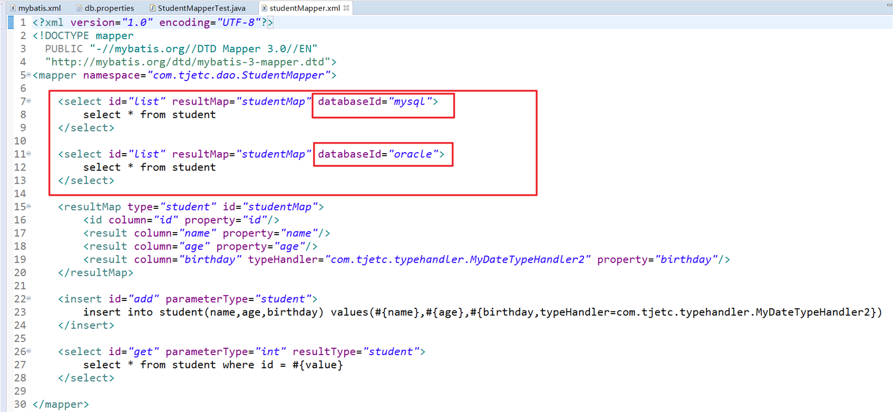
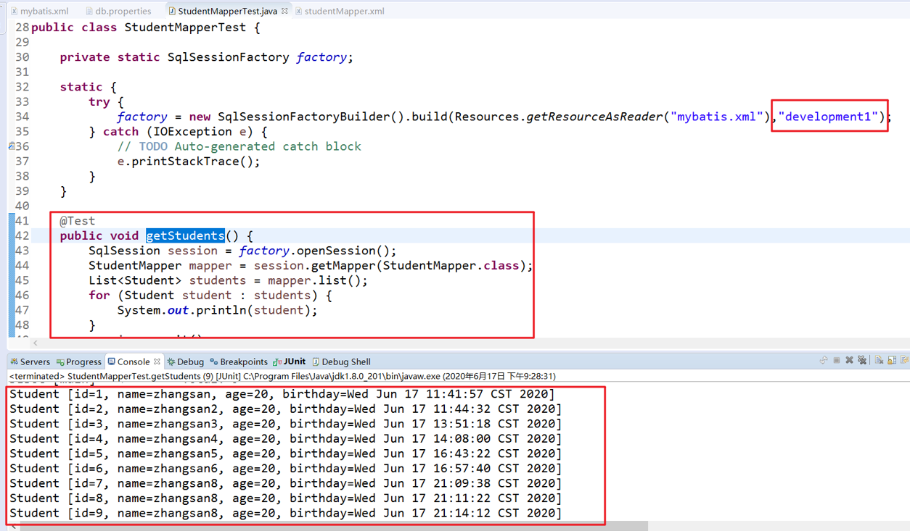

### 1、TypeHandler

#### 1.1、什么是TypeHandler

TypeHandlers（类型处理器）：就是用来完成 JavaType 和 JdbcType 之间的转换

数据类型映射，是 ORM（Object Relation Mapping）框架中最关键的问题

 

#### 1.2、标准的TypeHandler

* 7 种基本类型和包装类 

* 其他

默认的标准处理器（以下展示仅为部分转换器）

| **类型处理器**       | **Java** **类型**              | **JDBC** **类型**                    |
| -------------------- | ------------------------------ | ------------------------------------ |
| `BooleanTypeHandler` | `java.lang.Boolean`, `boolean` | 数据库兼容的 `BOOLEAN`               |
| `ByteTypeHandler`    | `java.lang.Byte`, `byte`       | 数据库兼容的 `NUMERIC` 或 `BYTE`     |
| `ShortTypeHandler`   | `java.lang.Short`, `short`     | 数据库兼容的 `NUMERIC` 或 `SMALLINT` |

* 通过程序显示 TypeHandler 有哪些

~~~java
@Test
public void testTypeHandler() {
    SqlSession session = factory.openSession();
    Configuration configuration = session.getConfiguration();
    Collection<TypeHandler<?>> typeHandlers = configuration.getTypeHandlerRegistry().getTypeHandlers();
    for (TypeHandler<?> typeHandler : typeHandlers) {
        System.out.println(typeHandler.getClass().getName());
    }
    session.close();
    System.out.println("ok...");
}
~~~

* 结果：（仅展示部分）

~~~
org.apache.ibatis.type.StringTypeHandler
org.apache.ibatis.type.FloatTypeHandler
org.apache.ibatis.type.ZonedDateTimeTypeHandler
org.apache.ibatis.type.ByteTypeHandler
org.apache.ibatis.type.InstantTypeHandler
org.apache.ibatis.type.BigDecimalTypeHandler
~~~

 

#### 1.3、自定义的TypeHandler

* 方式一：继承 BaseTypeHandler 类

步骤一：继承 BaseTypeHandler 类，重写四个方法

 

步骤二：在 mybatis.xml 中配置 typeHandlers 节点，在该节点的子节点中配置自定义的 MyTypeHandler 类的路径，以及转换的类型

 

步骤二：测试

 

* 方式二：实现 TypeHandler 接口

1. 全局配置

步骤一：实现 TypeHandler 接口

 

步骤二：在 mybatis.xml 中配置 typeHandlers 节点，在该节点的子节点中配置自定义的 MyTypeHandler 类的路径，以及转换的类型

 

2. 局部配置

局不配置则需要在 mapper.xml 中进行局部配置，在 mybatis.xml 中就不需要再配置 typeHandlers 节点，其他的步骤保持不变。

 

 

### 2、ObjectFactory配置

* 当 mybatis 每次创建一个新的结果集对象时，都需要使用 ObjectFactory 实例。

* 如果希望重写默认 ObjectFactory 的行为，可以自定义对象工厂

每次 MyBatis 创建结果对象的新实例时，它都会使用一个对象工厂（ObjectFactory）实例来完成实例化工作。 默认的对象工厂需要做的仅仅是实例化目标类，要么通过默认无参构造方法，要么通过存在的参数映射来调用带有参数的构造方法。 如果想覆盖对象工厂的默认行为，可以通过创建自己的对象工厂来实现。

ObjectFactory 接口很简单，它包含两个创建实例用的方法，一个是处理默认无参构造方法的，另外一个是处理带参数的构造方法的。 另外，setProperties 方法可以被用来配置 ObjectFactory，在初始化你的 ObjectFactory 实例后，objectFactory 元素体中定义的属性会被传递给 setProperties 方法。

* 从执行结果来看，创建结果集的步骤如下：

1. 首先进行初始化参数，也就是根据 objectFactory 中的配置；

2. 然后创建了一个 ArrayList 对象；

3. 再创建 2 个 Student 对象（注意：查询结果有几条就创建几个 ）；

4. 将 2 个对象设置到 ArrayList 中封装成我们需要的返回类型 List；

 

#### 结论

1、在获取 SQL session 对象的过程中就已经调用了 DefaultObjectFactory 中的 setProperties 方法，其实这个不难理解，毕竟在获取 SQL session 之前就已经加载了 mybatis 的配置文件，首先当然要进行配置；

2、然后会进入到 DefaultObjectFactory 中的 isCollection 方法，而传给它的参数类型就是我在映射器接口中定义的返回类型；

3、不管查询出多少条数据，也不管返回类型是什么，首先都会调用 create 方法创建一个 ArrayList 对象；

4、查询出多少条数据，就会调用多少次 create 方法，将一条数据封装成一个类并进行实例化；

5、将 ResultSet 结果集的数据映射到实体类对象的对应的属性中；

6、将实体类对象放入到集合中。

 

 

### 3、拦截器plugin配置

MyBatis 允许你在映射语句执行过程中的某一点进行拦截调用。默认情况下，MyBatis 允许使用插件来拦截的方法调用包括：

`Executor (update, query, flushStatements, commit, rollback, getTransaction, close, isClosed)`

`ParameterHandler (getParameterObject, setParameters)`

`ResultSetHandler (handleResultSets, handleOutputParameters)`

`StatementHandler (prepare, parameterize, batch, update, query)`

这些类中方法的细节可以通过查看每个方法的签名来发现，或者直接查看 MyBatis 发行包中的源代码。 如果你想做的不仅仅是监控方法的调用，那么你最好相当了解要重写的方法的行为。 因为在试图修改或重写已有方法的行为时，很可能会破坏 MyBatis 的核心模块。 这些都是更底层的类和方法，所以使用插件的时候要特别当心。

通过 MyBatis 提供的强大机制，使用插件是非常简单的，只需实现 Interceptor 接口，并指定想要拦截的方法签名即可。

下面的插件将会拦截在 Executor  addupdate   Executor 

~~~java
@Intercepts({@Signature(
		type=Executor.class,
		method="update",
		args={MappedStatement.class,Object.class}
		)})
public class MyInterceptor implements Interceptor {
    
    private Properties properties;
    
	public void setProperties(Properties properties) {
		this.properties = properties;
		System.out.println("1:"+this.properties);
	}

	@Override
	public Object intercept(Invocation invocation) throws Throwable {
		System.out.println(this.properties);
		System.out.println("预处理");
		Object proceed = invocation.proceed();
		System.out.println("后处理");
		return proceed;
	}

}
~~~

 

~~~xml
<plugins>
	<plugin interceptor="com.tjetc.plugins.MyInterceptor">
	  <property name="p" value="200"/>
	</plugin>
</plugins>
~~~

 

~~~java
@Test
public void testAdd() {
    SqlSession session = factory.openSession();
    StudentMapper mapper = session.getMapper(StudentMapper.class);
    System.out.println(mapper.getClass());
    Student student = new Student("zs",20,new Date());
    mapper.add(student);
    session.commit();
    session.close();
    System.out.println("ok...");
}
~~~

 

~~~
{p=200}
预处理
DEBUG [main] - Opening JDBC Connection
DEBUG [main] - Created connection 24567020.
DEBUG [main] - Setting autocommit to false on JDBC Connection [com.mysql.jdbc.JDBC4Connection@176dcec]
DEBUG [main] - ==>  Preparing: insert into student(name,age,birthday) values(?,?,?) 
---------
MyDateTypeHandler2.setNonNullParameter()...Wed Jun 17 16:41:25 CST 2020==>2020-06-17 16:41:25
DEBUG [main] - ==> Parameters: zs(String), 20(Integer), 2020-06-17 16:41:25(String)
DEBUG [main] - <==    Updates: 1
后处理
~~~

 

 

### 4、数据库环境environments配置

MyBatis 可以配置成适应多种环境，这种机制有助于将 SQL 映射应用于多种数据库之中， 现实情况下有多种理由需要这么做。例如，开发、测试和生产环境需要有不同的配置；或者想在具有相同 Schema 的多个生产数据库中使用相同的 SQL 映射。还有许多类似的使用场景。

不过要记住：尽管可以配置多个环境，但每个 SqlSessionFactory 实例只能选择一种环境。

所以，如果你想连接两个数据库，就需要创建两个 SqlSessionFactory 实例，每个数据库对应一个。而如果是三个数据库，就需要三个实例，依此类推，记起来很简单

为了指定创建哪种环境，只要将它作为可选的参数传递给 SqlSessionFactoryBuilder 

 

配置 db.properties 文件

~~~properties
jdbc.driver=com.mysql.jdbc.Driver
jdbc.url1=jdbc:mysql:///test02
jdbc.url2=jdbc:mysql:///test01
jdbc.username=root
jdbc.password=123looper.
~~~

在 mybatis.xml 文件中配置两个环境，默认的环境为 development1

~~~xml
<environments default="development1">
    <environment id="development1">
        <transactionManager type="JDBC" />
        <dataSource type="POOLED">
            <property name="driver" value="${jdbc.driver}" />
            <property name="url" value="${jdbc.url1}" />
            <property name="username" value="${jdbc.username}" />
            <property name="password" value="${jdbc.password}" />
        </dataSource>
    </environment>
    <environment id="development2">
        <transactionManager type="JDBC" />
        <dataSource type="POOLED">
            <property name="driver" value="${jdbc.driver}" />
            <property name="url" value="${jdbc.url2}" />
            <property name="username" value="${jdbc.username}" />
            <property name="password" value="${jdbc.password}" />
        </dataSource>
    </environment>
</environments>
~~~

使用的时候，在 SqlSessionFactoryBuilder ，需要选择环境，没有选择环境则使用默认的环境

~~~java
public class StudentMapperTest {

	private static SqlSessionFactory factory;
	
	static {
		try {
			factory = new SqlSessionFactoryBuilder().build(Resources.getResourceAsReader("mybatis.xml"),"development2");
		} catch (IOException e) {
			// TODO Auto-generated catch block
			e.printStackTrace();
		}
	}
	
	@Test
	public void getStudents() {
		SqlSession session = factory.openSession();
		StudentMapper mapper = session.getMapper(StudentMapper.class);
		List<Student> students = mapper.list();
		for (Student student : students) {
			System.out.println(student);
		}
		session.commit();
		session.close();
	}

}
~~~

 

 

### 5、transactionManager事务管理

MyBatis 可以配置成适应多种环境，这种机制有助于将 SQL 映射应用于多种数据库之中， 现实情况下有多种理由需要这么做。

例如，开发、测试和生产环境需要有不同的配置；或者想在具有相同 Schema 的多个生产数据库中使用相同的 SQL 映射，还有许多类似的使用场景。

不过要记住：尽管可以配置多个环境，但每个 SqlSessionFactory 实例只能选择一种环境。

所以，如果你想连接两个数据库，就需要创建两个 SqlSessionFactory 实例，每个数据库对应一个。而如果是三个数据库，就需要三个实例，依此类推，记起来很简单。为了指定创建哪种环境，只要将它作为可选的参数传递给  SqlSessionFactoryBuilder 

 

 

### 6、DateSource数据源

DateSource 数据源有三种：UNPOOLED、POOLED、JNDI

 

#### 6.2、POOLED数据库连接池

这个数据源缓存 JDBC 连接对象用于避免每次都要连接和生成连接实例而需要的验证时间 。对于并发 WEB 应用，这种方式非常流行因为它有最快的响应时间

 

#### 6.2、UNPOOLED不使用数据库连接池

这个数据源实现只是在每次请求的时候简单的打开和关闭一个连接。虽然这有点慢，但作为一些不需要性能和立即响应的简单应用来说，不失为一种好选择 

 

#### 6.3、JNDI依赖于 Java EE 应用服务器

这个数据源实现是为了准备和 JavaEE 应用服务一起使用，可以在外部也可以在内部配置这个数据源，然后在 JNDI 上下文中引用它

 

 

### 7、databaseProvidor多数据库支持

databaseIdProvider 元素主要是为了支持不同厂商的数据库，即同时支持多个数据库

这个配置非常有用，项目如何同时支持多种数据库：

* 传统做法是生成多套 mapper 文件，在 mybatis.xml 中配置使用那套映射文件。
* 这个做法的很大缺陷是：多套映射文件中，会有很多接口的实现是相同的，如果代码修改，需要同时修改多套文件。这给开发额外增加了很大的工作量。

步骤：

1. 在 db.properties 中配置不同数据库的信息

2. 在 mybatis.xml 中配置不同的环境，配置 dataSource 和 databaseProvider 节点

3. 在对应 StudentMapper.xml 文件的 sql 语句中选择数据库

4. 测试

 

#### 代码

~~~properties
jdbc.driver=com.mysql.jdbc.Driver
jdbc.url=jdbc:mysql:///cc
jdbc.username=root
jdbc.password=123

jdbc.driver2=oracle.jdbc.driver.OracleDriver
jdbc.url2=jdbc:oracle:thin:@localhost:1521:mybatis
jdbc.username2=root
jdbc.password2=123
~~~

 

~~~xml
<environments default="dev">
		<environment id="dev">
			<transactionManager type="JDBC"></transactionManager>
			<dataSource type="POOLED">
				<property name="driver" value="${jdbc.driver}" />
				<property name="url" value="${jdbc.url}" />
				<property name="username" value="${jdbc.username}" />
				<property name="password" value="${jdbc.password}" />
			</dataSource>
		</environment>
		<environment id="dev2">
			<transactionManager type="JDBC"></transactionManager>
			<dataSource type="POOLED">
				<property name="driver" value="${jdbc.driver}" />
				<property name="url" value="${jdbc.url2}" />
				<property name="username" value="${jdbc.username}" />
				<property name="password" value="${jdbc.password}" />
			</dataSource>
		</environment>
	</environments>
	 <databaseIdProvider type="DB_VENDOR">
                <property name="SQL Server" value="sqlserver" />
                <property name="DB2" value="db2" />
                <property name="Oracle" value="oracle" />
                <property name="MySQL" value="mysql" />
        </databaseIdProvider>
~~~

 

~~~xml
<select id="list" resultMap="studentMap" databaseId="mysql">
    select id,name,age,birthday from student
</select>
<select id="list" resultMap="studentMap" databaseId="oracle">
    select id,name,age,birthday from student
</select>
~~~

 

~~~java
List<Student> list();
~~~

 

~~~java
@Test
public void testList() {
    SqlSession session = factory.openSession();
    StudentMapper mapper = session.getMapper(StudentMapper.class);
    List<Student> list = mapper.list();
    for (Student student : list) {
        System.out.println(student);
    }
    session.close();
    System.out.println("ok...");
}
~~~

