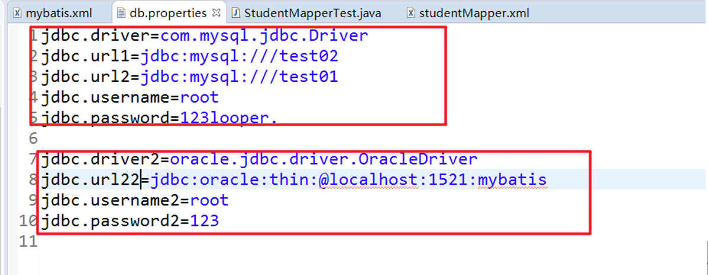
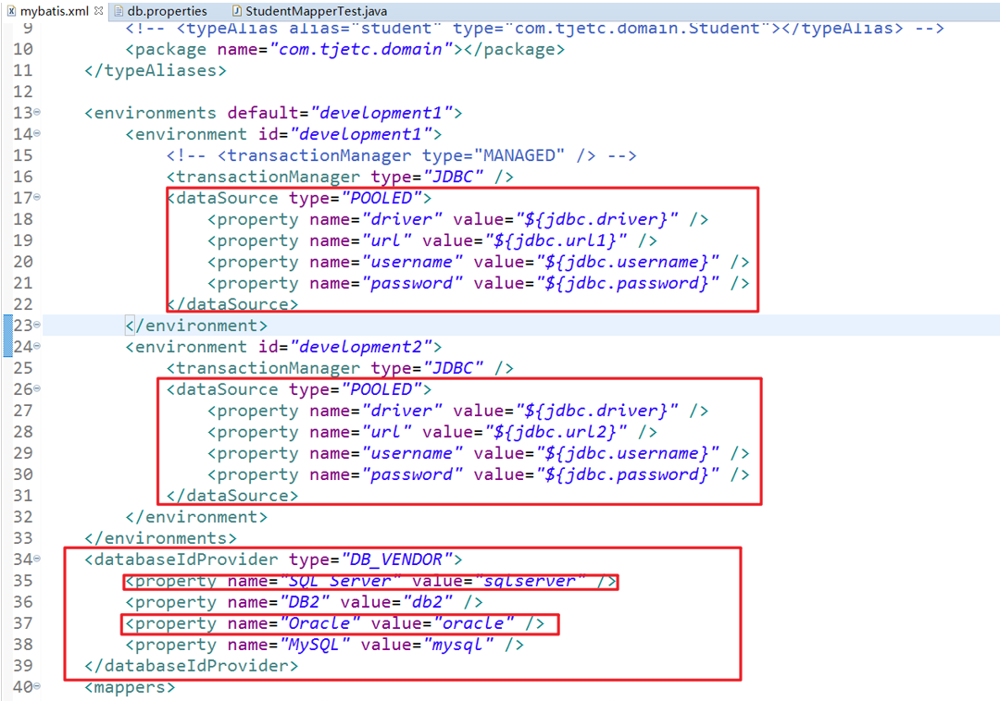
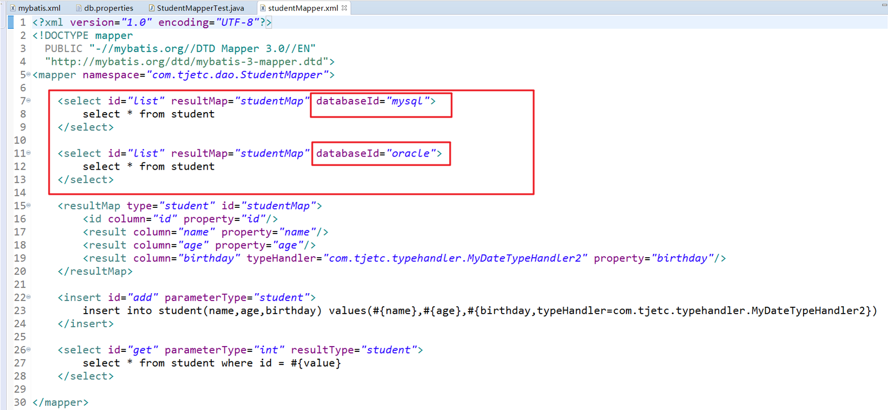
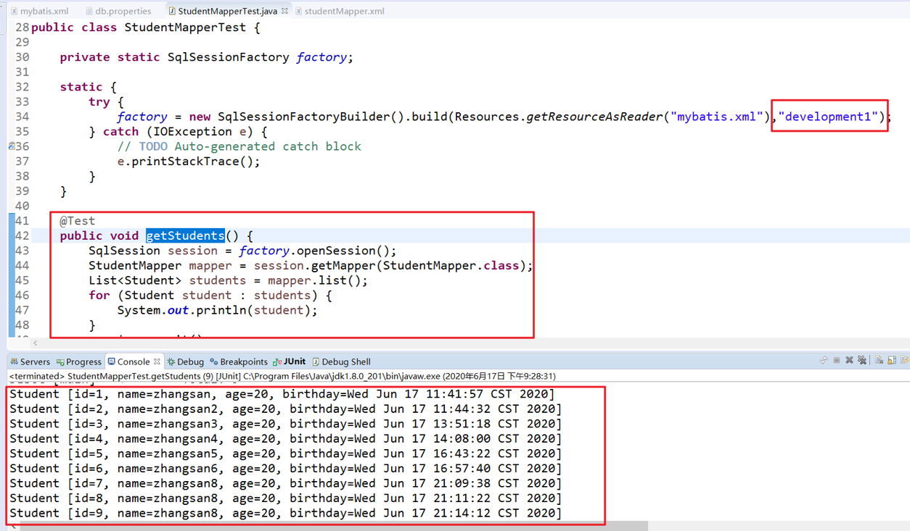

### 1、TypeHandler

#### 1.1、什么是TypeHandler

TypeHandlers（类型处理器）：就是用来完成 JavaType 和 JdbcType 之间的转换

数据类型映射，是 ORM（Object Relation Mapping）框架中最关键的问题

 

#### 1.2、标准的TypeHandler

MyBatis 设置预处理语句（PreparedStatement）中的参数

默认的标准处理器（以下展示仅为部分转换器）

| **类型处理器**       | **Java** **类型**              | **JDBC** **类型**                    |
| -------------------- | ------------------------------ | ------------------------------------ |
| `BooleanTypeHandler` | `java.lang.Boolean`, `boolean` | 数据库兼容的 `BOOLEAN`               |
| `ByteTypeHandler`    | `java.lang.Byte`, `byte`       | 数据库兼容的 `NUMERIC` 或 `BYTE`     |
| `ShortTypeHandler`   | `java.lang.Short`, `short`     | 数据库兼容的 `NUMERIC` 或 `SMALLINT` |

* 通过程序显示 TypeHandler 有哪些

~~~java
@Test
public void testTypeHandler() {
    SqlSession session = factory.openSession();
    Configuration configuration = session.getConfiguration();
    Collection<TypeHandler<?>> typeHandlers = configuration.getTypeHandlerRegistry().getTypeHandlers();
    for (TypeHandler<?> typeHandler : typeHandlers) {
        System.out.println(typeHandler.getClass().getName());
    }
    session.close();
    System.out.println("ok...");
}
~~~

* 结果：（仅展示部分）

~~~
org.apache.ibatis.type.StringTypeHandler
org.apache.ibatis.type.FloatTypeHandler
org.apache.ibatis.type.ZonedDateTimeTypeHandler
org.apache.ibatis.type.ByteTypeHandler
org.apache.ibatis.type.InstantTypeHandler
org.apache.ibatis.type.BigDecimalTypeHandler
~~~

 

#### 1.3、自定义的TypeHandler

方式一：继承 BaseTypeHandler 类

方式二：实现 TypeHandler 接口

1. 全局配置

2. 局部配置

### 2、ObjectFactory

### 3、拦截器plugin配置

### 4、数据库环境environment配置

配置 db.properties 文件

~~~properties
jdbc.driver=com.mysql.jdbc.Driver
jdbc.url1=jdbc:mysql:///test02
jdbc.url2=jdbc:mysql:///test01
jdbc.username=root
jdbc.password=123looper.
~~~

在 mybatis.xml 文件中配置两个环境，默认的环境为 development1

~~~xml
<environments default="development1">
    <environment id="development1">
        <transactionManager type="JDBC" />
        <dataSource type="POOLED">
            <property name="driver" value="${jdbc.driver}" />
            <property name="url" value="${jdbc.url1}" />
            <property name="username" value="${jdbc.username}" />
            <property name="password" value="${jdbc.password}" />
        </dataSource>
    </environment>
    <environment id="development2">
        <transactionManager type="JDBC" />
        <dataSource type="POOLED">
            <property name="driver" value="${jdbc.driver}" />
            <property name="url" value="${jdbc.url2}" />
            <property name="username" value="${jdbc.username}" />
            <property name="password" value="${jdbc.password}" />
        </dataSource>
    </environment>
</environments>
~~~

使用的时候，在 SqlSessionFactoryBuilder ，需要选择环境，没有选择环境则使用默认的环境

~~~java
public class StudentMapperTest {

	private static SqlSessionFactory factory;
	
	static {
		try {
			factory = new SqlSessionFactoryBuilder().build(Resources.getResourceAsReader("mybatis.xml"),"development2");
		} catch (IOException e) {
			// TODO Auto-generated catch block
			e.printStackTrace();
		}
	}
	
	@Test
	public void getStudents() {
		SqlSession session = factory.openSession();
		StudentMapper mapper = session.getMapper(StudentMapper.class);
		List<Student> students = mapper.list();
		for (Student student : students) {
			System.out.println(student);
		}
		session.commit();
		session.close();
	}

}
~~~

### 5、transactionManager

### 6、DateSource配置

DateSource 数据源有三种：UNPOOLED、POOLED、JNDI

#### 6.2、POOLED

数据库连接池

#### 6.2、UNPOOLED

不使用数据库连接池

#### 6.3、JNDI

依赖于 Java EE 应用服务器

### 7、databaseProvidor多数据库支持

databaseIdProvider 元素主要是为了支持不同厂商的数据库，即同时支持多个数据库

这个配置非常有用，项目如何同时支持多种数据库：

* 传统做法是生成多套 mapper 文件，在 mybatis.xml 中配置使用那套映射文件。
* 这个做法的很大缺陷是：多套映射文件中，会有很多接口的实现是相同的，如果代码修改，需要同时修改多套文件。这给开发额外增加了很大的工作量。

步骤：

1. 在 db.properties 中配置不同数据库的信息

2. 在 mybatis.xml 中配置不同的环境，配置 dataSource 和 databaseProvider 节点

3. 在对应 StudentMapper.xml 文件的 sql 语句中选择数据库

4. 测试

#### [案例源码：work0617-04]( https://github.com/1004032560 )

