### 1、mappers配置的四种方法

#### 1.1、使用相对于类路径的资源

~~~xml
<mappers>
    <mapper resource="com/tjetc/domain/UserMapper.xml"/>
</mappers>
~~~

<br>

#### 1.2、使用完全限定路径

~~~xml
<mappers>
    <mapper url="file:///E:\mybatis\work0617-02\src\main\java\com\tjetc\domain\UserMapper.xml"/>
</mappers>
~~~

<br>

#### 1.3、使用Mapper接口的类路径

~~~xml
<mappers>
    <mapper class="com.tjetc.mapper.UserMapper"/>
</mappers>
~~~

**要求： Mapper 接口名称和 mapper 映射文件名称相同，并且放在同一个目录中**

<br>

#### 1.4、使用Mapper接口所在的包  （推荐使用）

~~~xml
<mappers>
    <package name="com.tjetc.mapper"></package>
</mappers>
~~~

**要求： Mapper 接口名称和 mapper 映射文件名称相同，并且放在同一个目录中**

<br>

<br>

## 2、XML映射文件

MyBatis 的真正强大在于它的语句映射，这是它的魔力所在。

由于它的异常强大，映射器的 XML 文件就显得相对简单。

如果拿它跟具有相同功能的 JDBC 代码进行对比，你会立即发现省掉了将近 95% 的代码。

MyBatis 致力于减少使用成本，让用户能更专注于 SQL 代码。

SQL 映射文件只有很少的几个顶级元素（按照应被定义的顺序列出）：

- `cache` – 该命名空间的缓存配置。
- `cache-ref` – 引用其它命名空间的缓存配置。
- `resultMap` – 描述如何从数据库结果集中加载对象，是最复杂也是最强大的元素。
- `sql` – 可被其它语句引用的可重用语句块。
- `insert` – 映射插入语句。
- `update` – 映射更新语句。
- `delete` – 映射删除语句。
- `select` – 映射查询语句。

<br>

<br>

### 2.1、select

查询语句是 MyBatis 中最常用的元素之一——光能把数据存到数据库中价值并不大，还要能重新取出来才有用，多数应用也都是查询比修改要频繁。 MyBatis 的基本原则之一是：在每个插入、更新或删除操作之间，通常会执行多个查询操作。因此，MyBatis 在查询和结果映射做了相当多的改进。一个简单查询的 select 元素是非常简单的。比如：

```xml
<select id="selectPerson" parameterType="int" resultType="hashmap">
  SELECT * FROM PERSON WHERE ID = #{id}
</select>
```


这个语句名为 selectPerson，接受一个 int（或 Integer）类型的参数，并返回一个 HashMap 类型的对象，其中的键是列名，值便是结果行中的对应值。

注意参数符号：`#{id}`

这就告诉 MyBatis 创建一个预处理语句（PreparedStatement）参数，在 JDBC 中，这样的一个参数在 SQL 中会由一个“?”来标识，并被传递到一个新的预处理语句中，就像这样：

```java
// 近似的 JDBC 代码，非 MyBatis 代码...
String selectPerson = "SELECT * FROM PERSON WHERE ID=?";
PreparedStatement ps = conn.prepareStatement(selectPerson);
ps.setInt(1,id);
```

<br>

#### 1.2.2、常用的属性有：

| 属性            | 描述                                                         |
| :-------------- | :----------------------------------------------------------- |
| `id`            | 在命名空间中唯一的标识符，可以被用来引用这条语句。           |
| `parameterType` | 将会传入这条语句的参数的类全限定名或别名。这个属性是可选的，因为 MyBatis 可以通过类型处理器（TypeHandler）推断出具体传入语句的参数，默认值为未设置（unset）。 |
| `resultType`    | 期望从这条语句中返回结果的类全限定名或别名。 注意，如果返回的是集合，那应该设置为集合包含的类型，而不是集合本身的类型。 resultType 和 resultMap 之间只能同时使用一个。 |
| `resultMap`     | 对外部 resultMap 的命名引用。结果映射是 MyBatis 最强大的特性，如果你对其理解透彻，许多复杂的映射问题都能迎刃而解。 resultType 和 resultMap 之间只能同时使用一个。 |
| `useCache`      | 将其设置为 true 后，将会导致本条语句的结果被二级缓存缓存起来，默认值：对 select 元素为 true。 |

<br>

<br>

### 2.2、案例：多参数类型进行匹配

#### 方式一：使用注解（推荐）

1. Mapper 接口中的多参数方法中添加注解 `@Param("参数")`，其中参数的应该与 sql 语句中的 `#{参数}` 中的参数对应

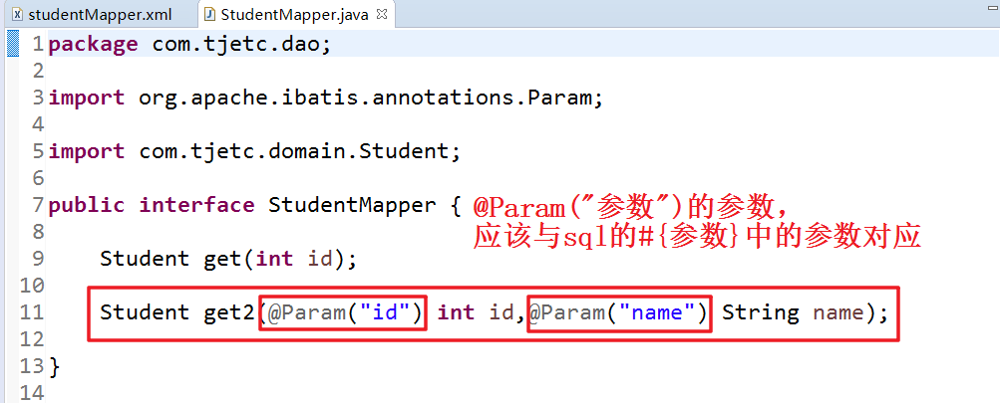

2. 在 Mapper.xml 中多参数传参的 sql 语句照常写

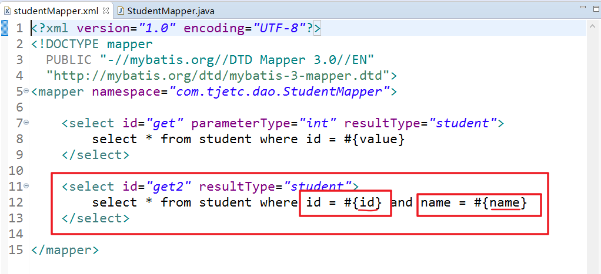

3. 测试

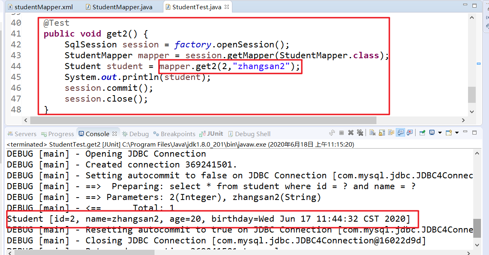

<br>

#### 方式二：arg（可读性比较差，顺序应该一一对应）

Mapper.xml 的 sql 中的 arg 参数起始默认从 0 开始，与 Mapper 接口中参数顺序一一对应，测试方法与使用注解的测试方法相同

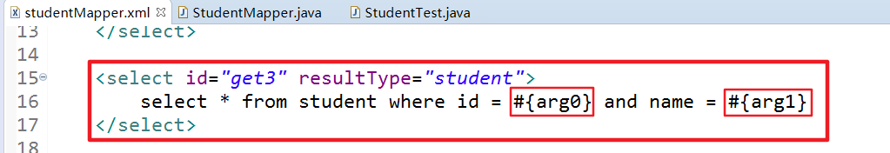

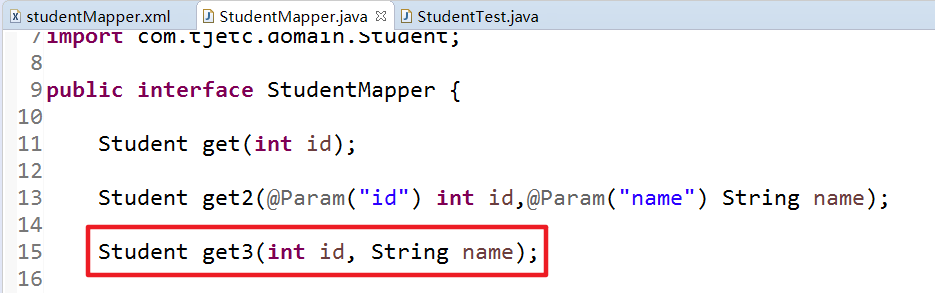

<br>

#### 方式三：param（可读性比较差，顺序应该一一对应）

Mapper.xml 的 sql 中的 param 参数起始默认从 1 开始，与 Mapper 接口中参数顺序一一对应，测试方法与使用注解的测试方法相同

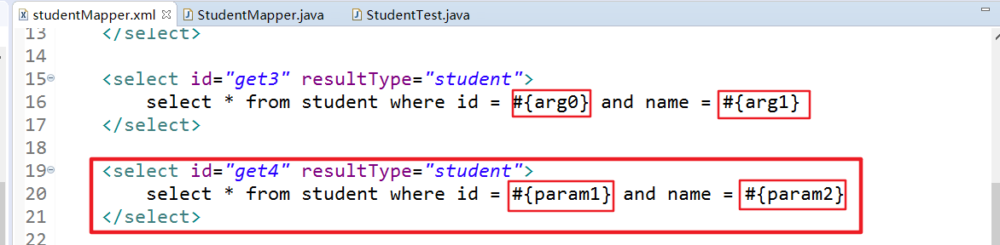

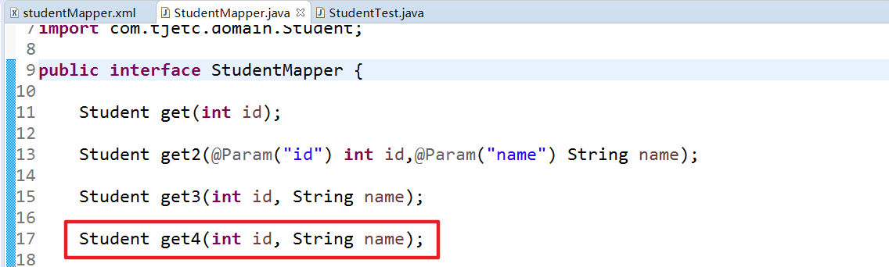

<br>

#### 方式四：使用Map

1. Mapper 接口中的参数类型为 Map 类型

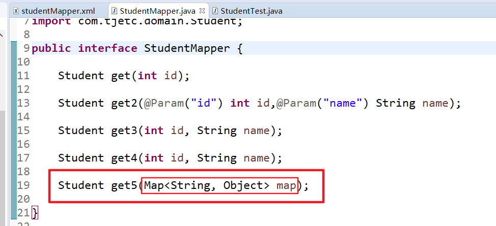

2. 在 Mapper.xml 中多参数传参的 sql 语句照常写

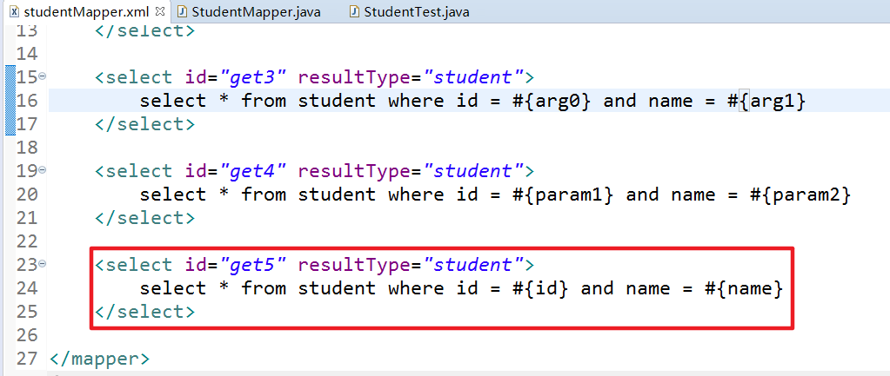

3. 测试，测试的时候创建一个 Map 集合将多个参数传进去，Map 中参数添加的顺序应该与 sql 中的顺序保持一致

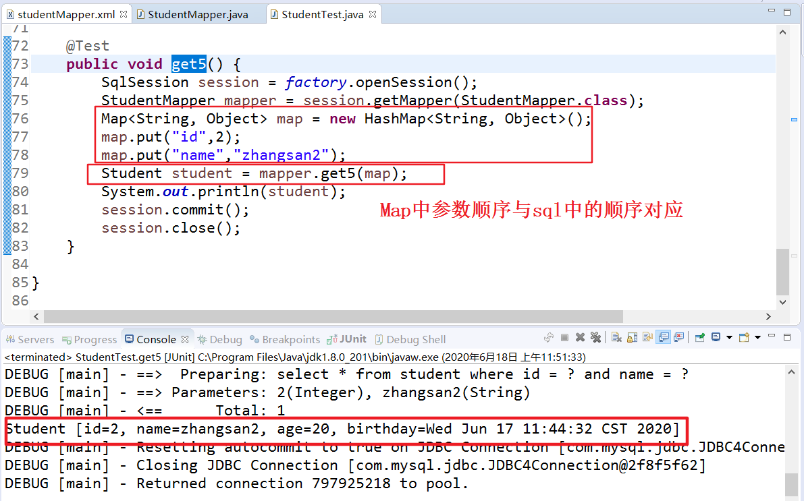

<br>

<br>

### 2.3、insert, update 和 delete

数据变更语句 insert，update 和 delete 的实现非常接近：

 Insert，Update，Delete 元素的常用属性

| 属性               | 描述                                                         |
| :----------------- | :----------------------------------------------------------- |
| `id`               | 在命名空间中唯一的标识符，可以被用来引用这条语句。           |
| `parameterType`    | 参数类型（类的全限定名或者别名）                             |
| `useGeneratedKeys` | 使用自动增长的，默认值：false。                              |
| `keyProperty`      | （仅适用于 insert 和 update）指定能够唯一识别对象的属性，MyBatis 会使用 getGeneratedKeys 的返回值或 insert 语句的 selectKey 子元素设置它的值，默认值：未设置（`unset`）。如果生成列不止一个，可以用逗号分隔多个属性名称。 |

<br>

<br>

### 2.4、主键自动增长

#### 2.4.1、方式一（推荐使用）

设置 `useGeneratedKeys="true"`，然后再把 `keyProperty="id"` 设置为目标属性，就能把自动递增的主键值设置到实体类的 id 属性中

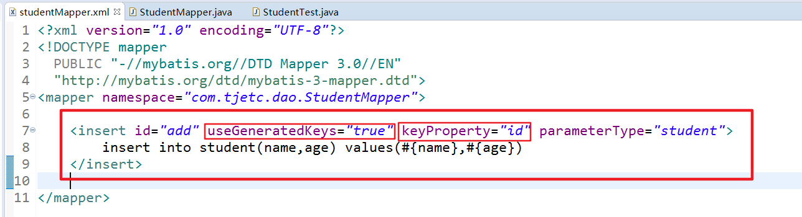

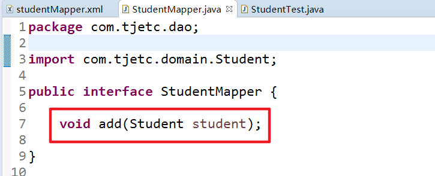

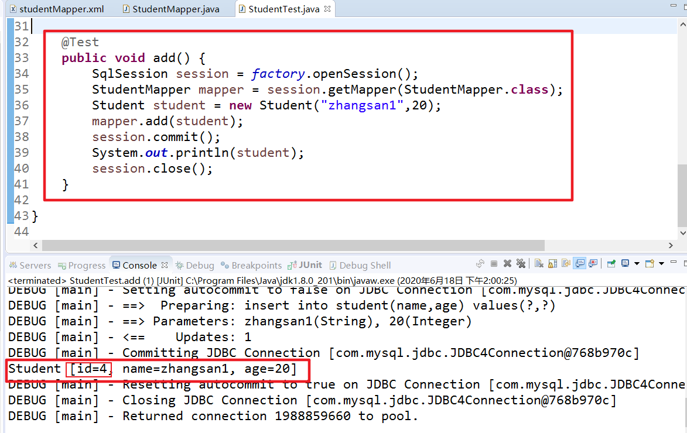

<br>

#### 2.4.2、方式二（不推荐使用）

在配置中写 selectKey 节点

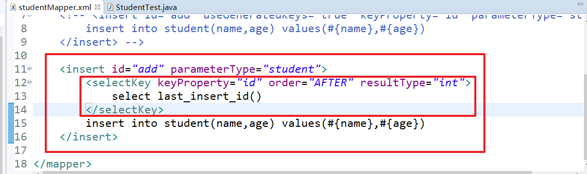

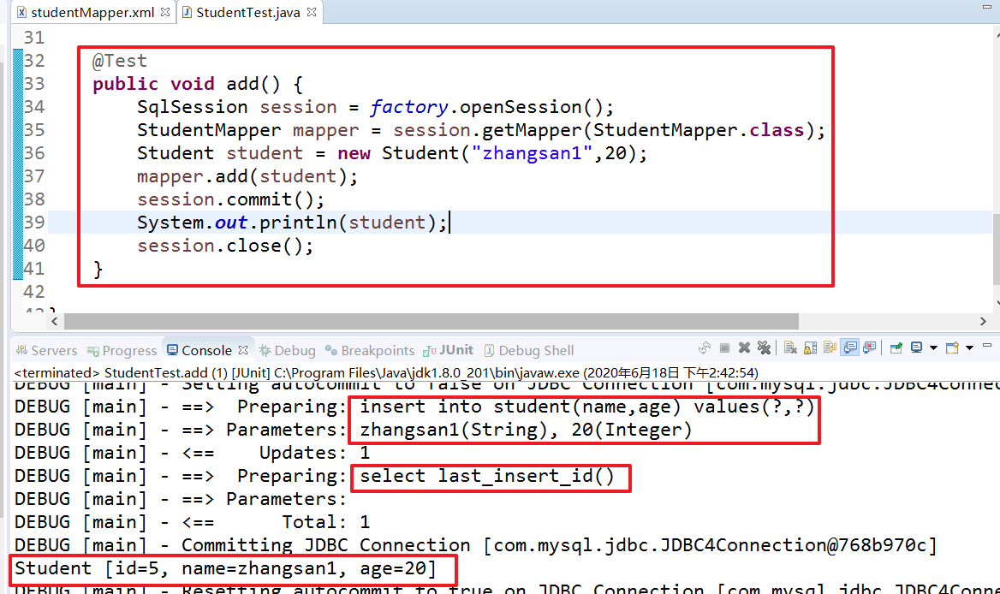

<br>

<br>

### 2.5、#{}和${}的区别

`#{}` 表示一个占位符号，通过 `#{}` 可以实现 preparedStatement 向占位符中设置值

自动进行java类型和jdbc类型转换，`#{}` 可以有效防止 sql 注入。

`#{}` 可以接收简单类型值或 POJO 属性值。 

如果 parameterType 传输单个简单类型值，`#{}` 括号中可以是value或其它名称。

<br>

`${}` 表示拼接sql串，通过 `${}` 可以将 parameterType 传入的内容拼接在 sql 中

不进行 jdbc 类型转换，

`${}` 可以接收简单类型值或 POJO 属性值。

如果 parameterType 传输单个简单类型值，`${}` 括号中只能是 value。

<br>

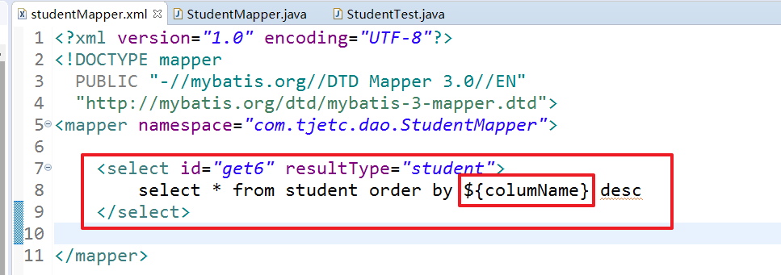

如果参数中添加注解，进行映射时，需要和注解中的参数保持一致

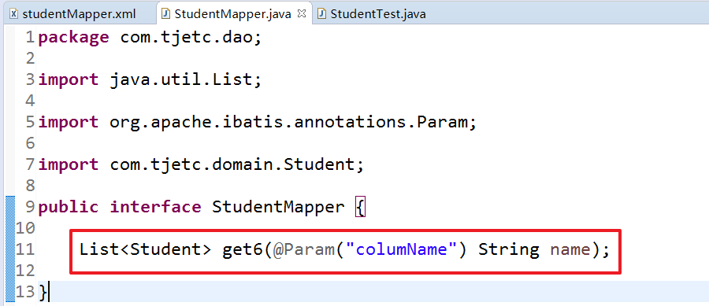


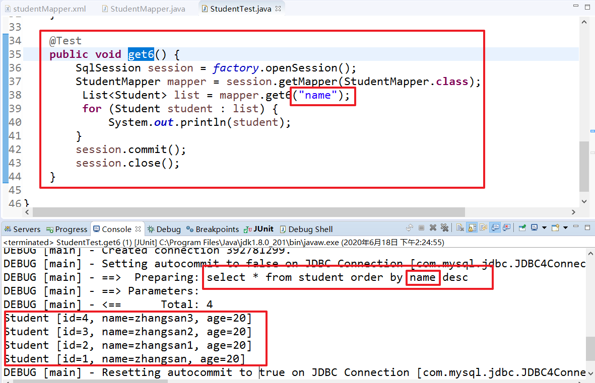


### 3、resultMap

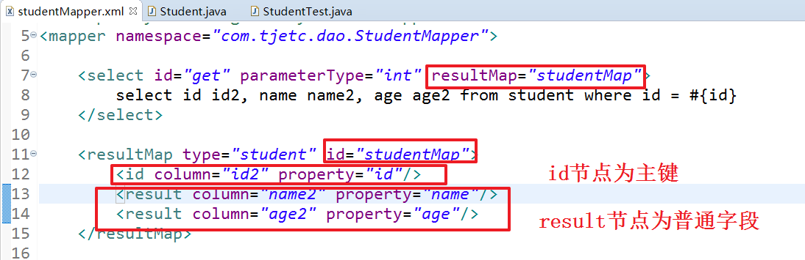


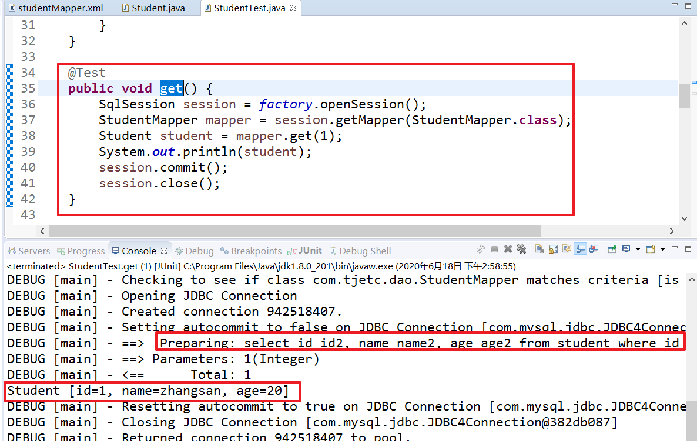


### 4、MyBatis缓存


#### 4.1、一级缓存

##### 概念

一级缓存是 SqlSession 级别的缓存，一级缓存的


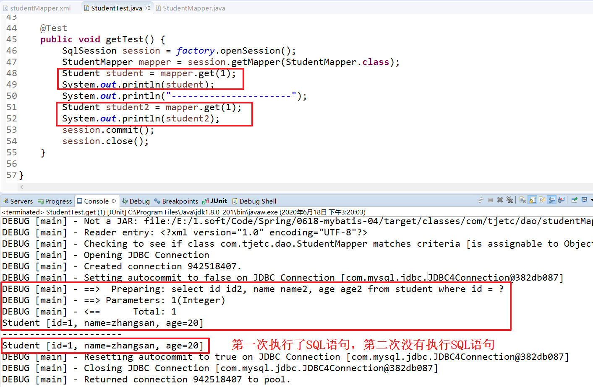


#### 4.1、二级缓存


开启二级缓存

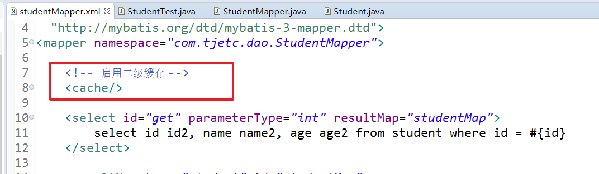

Student 类实现序列化接口

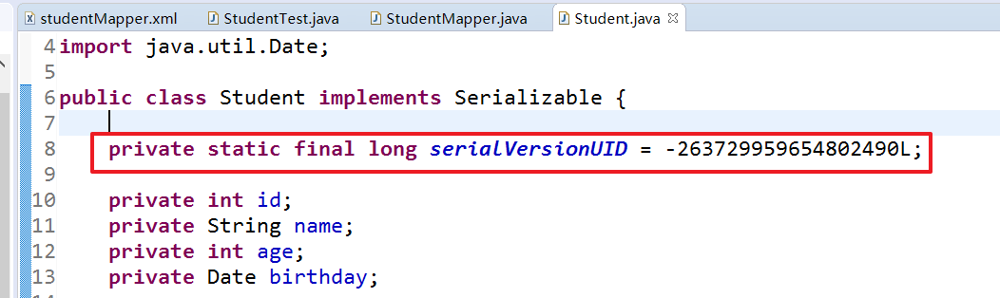


一级二级缓存并存的执行顺序


 判断二级缓存是否开启，如果没开启，再判断一级缓存是否开启，如果没开启，直接查数据库,如果一级缓存关闭，即使二级缓存开启也没有数据,如果二级缓存关闭，直接判断一级缓存是否有数据，如果没有就查数据库,如果二级缓存开启，先判断二级缓存有没有数据，如果有就直接返回；如果没有，就查询一级缓存，如果有就返回，没有就查询数据库 


先从二级缓存查找，查找到了直接拿出返回

如果二级缓存查找不到，到一级缓存中，拿到了直接返回

如果一级缓存查找不到,发sql语句到数据库查找,将查询结果放到一级缓存,session关闭会清空一级缓存,会将数据放到二级缓存中

4.session进行insert update delete后提交会清空一二级缓存.


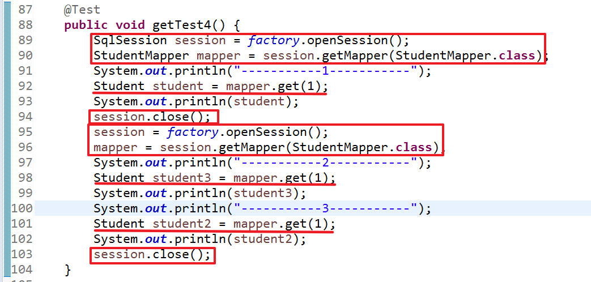


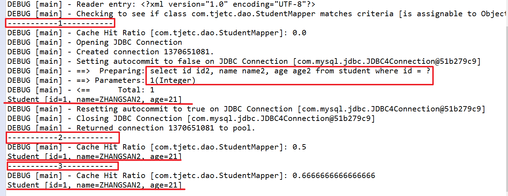