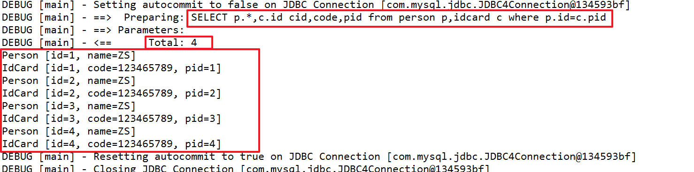

## 1、MyBatis整合EhCache

### 1.1、EhCache

* 是 一个纯 Java 的进程缓存框架

* 是一种广泛使用的开源的 Java 分布式缓存，具有快速、精干等特点

* 是 Hibernate 中默认的 CacheProvider

 

### 1.2、MyBatis整合EhCache的原理

通过实现 Cache 接口可以实现 mybatis 缓存数据通过其它缓存数据库整合

Mybatis 的特长是 sql 操作

缓存数据的管理不是mybatis的特长，为了提高缓存的性能将 Mybatis 和第三方的缓存数据库整合，比如 ehcache、memcache、redis 等

 

### 1.3、步骤

1. 过程：引入 Maven 依赖，创建 ehcache.xml 配置文件，mapper.xml 中开启 EhCache 缓存

 

2. 测试结果

 

3. 本地文件中的显示

 

 

 

## 2、MyBatis动态Sql

MyBatis 的动态 SQL 是基于 OGNL（Object Graph Navigate Language）对象图导航语言

它可以帮助我们方便的在 SQL 语句中实现某些逻辑

MyBatis 中用于实现动态 SQL 的元素主要有：

### 2.1、if

[案例源码](0619-mybatis-02)

if 就是简单的条件判断，利用 if 语句我们可以实现某些简单的条件选择

注意：if 只要条件满足该分支就执行,也就说可以同时执行多个 if 分支

 

### 2.2、choose

choose 元素的作用就相当于 Java 中的 switch 语句，基本上跟 JSTL 中的 choose 的作用和用法是一样的，通常都是与 when 和 otherwise 搭配的

when 元素表示当 when 中的条件满足的时候就输出其中的内容，跟 Java 中的 switch 效果差不多的是按照条件的顺序，当 when 中有条件满足的时候，就会跳出 choose

注意：所有的 when 和 otherwise 条件中，只有一个会输出，当所有的条件都不满足的时候就输出 otherwise 中的内容

[案例源码](0619-mybatis-02)

 

### 2.3、where

where 元素的作用是会在写入 where 元素的地方输出一个 where，另外一个好处是你不需要考虑 where 元素里面的条件输出是什么样子的，MyBatis 会智能的帮你处理，如果所有的条件都不满足那么 MyBatis 就会查出所有的记录，如果输出后是and 开头的，MyBatis 会把第一个 and 忽略，当然如果是 or 开头的，MyBatis 也会把它忽略；此外，在where 元素中你不需要考虑空格的问题，MyBatis会智能的帮你加上。

[案例源码](0619-mybatis-02)

 

### 2.4、trim

trim 元素的主要功能是可以在自己包含的内容前加上某些前缀，也可以在其后加上某些后缀，与之对应的属性是 prefix 和 suffix；可以把包含内容的首部某些内容覆盖，即忽略，也可以把尾部的某些内容覆盖，对应的属性是 prefixOverrides 和 suffixOverrides；正因为 trim 有这样的功能，所以我们也可以非常简单的利用 trim 来代替 where 元素的功能

[案例源码](0619-mybatis-02)

 

### 2.5、set

set 元素主要是用在更新操作的时候，它的主要功能和 where 元素其实是差不多的，主要是在包含的语句前输出一个 set，然后如果包含的语句是以逗号结束的话将会把该逗号忽略，如果 set 包含的内容为空的话则会出错。有了 set 元素我们就可以动态的更新那些修改了的字段。

[案例源码](0619-mybatis-02)

 

### 2.6、foreach

foreach 的主要用在构建 in 条件中，它可以在 SQL 语句中进行迭代一个集合。

foreach 元素的属性主要有 item，index，collection，open，separator，close。

* item 表示集合中每一个元素进行迭代时的别名，

* index 指定一个名字，用于表示在迭代过程中，每次迭代到的位置，

* open 表示该语句以什么开始，

* separator 表示在每次进行迭代之间以什么符号作为分隔符，

* close 表示以什么结束，

在使用 foreach 的时候最关键的也是最容易出错的就是 collection 属性，该属性是必须指定的，但是在不同情况下，该属性的值是不一样的，主要有一下3种情况：

1. 如果传入的是单参数且参数类型是一个 List 的时候，collection 属性值为 list

2. 如果传入的是单参数且参数类型是一个 array 数组的时候，collection 的属性值为 array

3. 如果传入的参数是多个的时候，我们就需要把它们封装成一个 Map 了，当然单参数也可以封装成 map，实际上如果你在传入参数的时候，在 MyBatis 里面也是会把它封装成一个 Map 的， map 的 key 就是参数名，所以这个时候 collection 属性值就是传入的 List 或 array 对象在自己封装的 map 里面的 key

 

#### 2.6.1、collection="list"

[案例源码](0619-mybatis-02)

 

#### 2.6.2、collection="array"

[案例源码](0619-mybatis-02)

 

#### 2.6.3、collection="map"

[案例源码](0619-mybatis-02)

方式一：

 

方式二：

 

 

## 3、Sql片段

sql 标签是用于抽取可重用的 sql 片段，将相同的，使用频繁的 SQL 片段抽取出来，单独定义，方便多次引用

抽取 SQL，引用 SQL

 

 

## 4、MyBatis多表关系

### 4.1、一对一

##### 概念

一个对一个,我中只有一个你,你中只有一个我.

例子：人和身份证是一对一关系

 

#### 4.1.1、添加

 

#### 4.1.2、查询

##### 关联嵌套 select 会产生 n+1

 

##### List集合会产生 n+1

 

##### Map 传参可以解决 n+1 问题

 

### 4.2、一对多

##### 概念

一个对多个，我中有多个你（collection），你中只有一个我（association）

例子：班级和学生是一对多关系

#### 4.2.1、添加

##### 步骤：

1. 创建学生表（student）和班级表（myclass）

2. 创建实体类 Student 和 MyClass

3. 创建 StudentMapper 接口和 MyClassMapper 接口
4. 创建 StudentMapper.xml 和 MyClassMapper.xml 配置文件
5. 进行添加，在 MyClassMapper.xml 中添加一个班级之后，使用自动生成的主键，然后将这个值作为生添加时的 cid

#### 4.2.2、查询

##### 4.2.2.1、一方查询多方

在 resultMap 中使用 collection 节点

select 嵌套产生 n+1

get

ResultMap 可以解决 n+1

##### 4.2.2.2、多方查询一方

在 resultMap 中使用 association 节点

 

### 4.3、多对多

