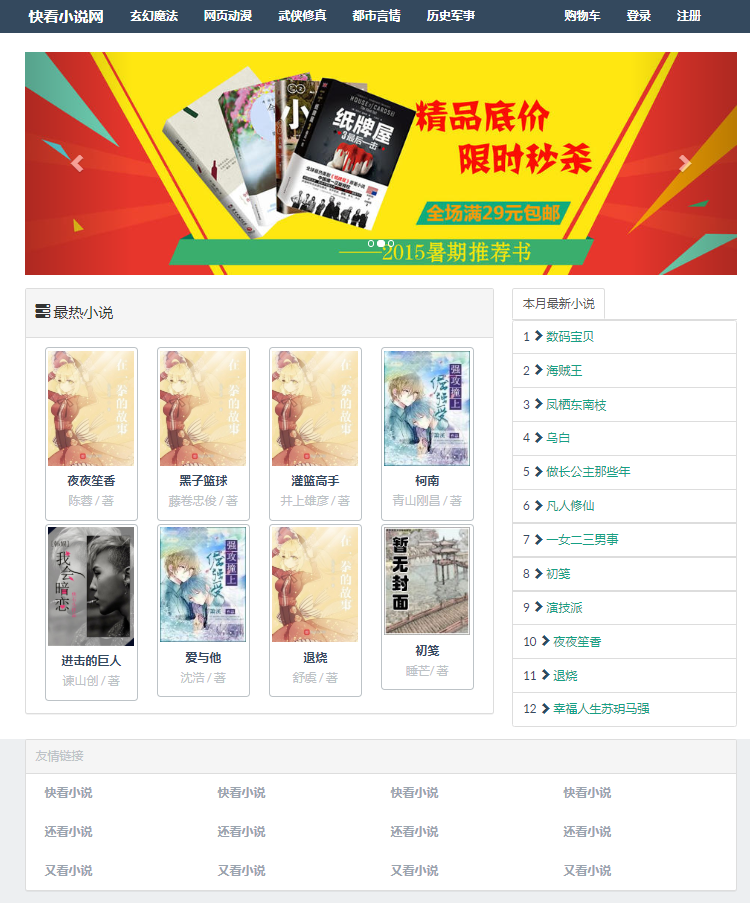
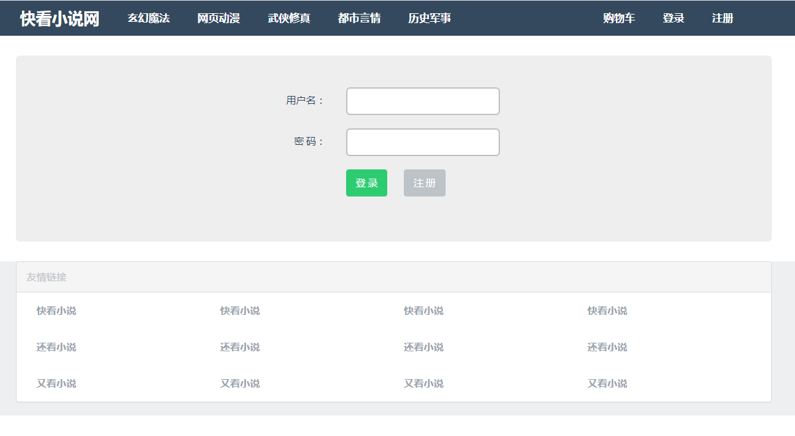
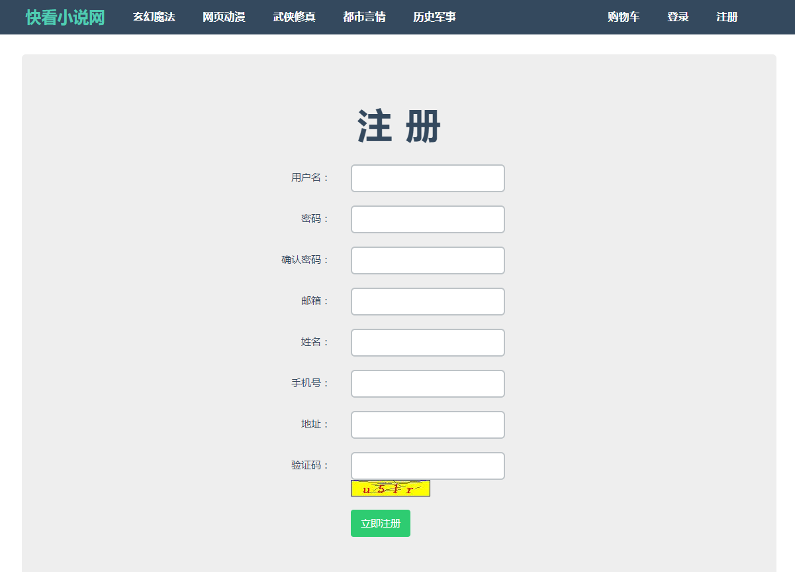
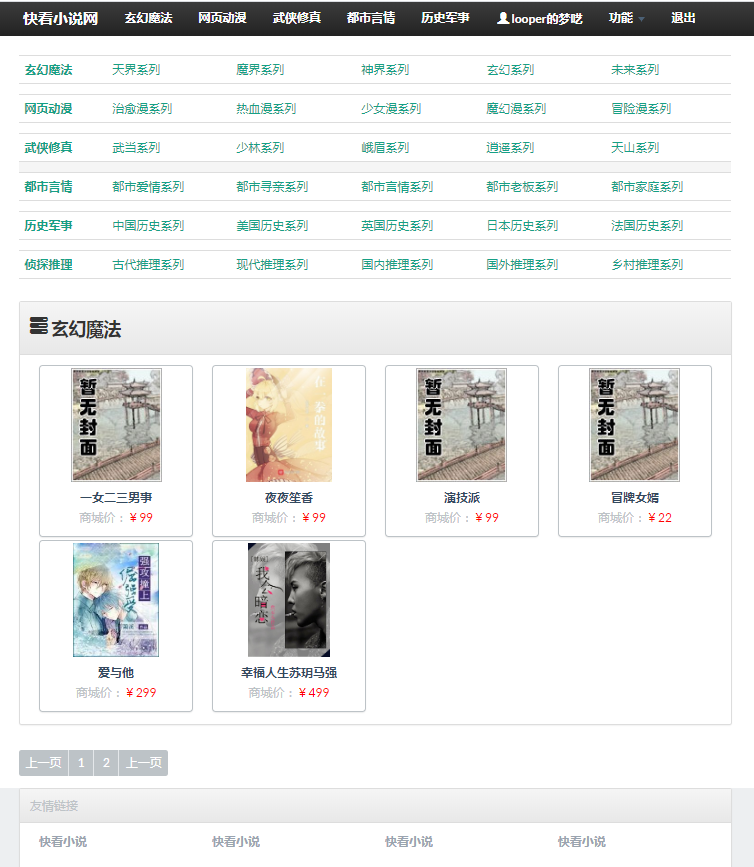
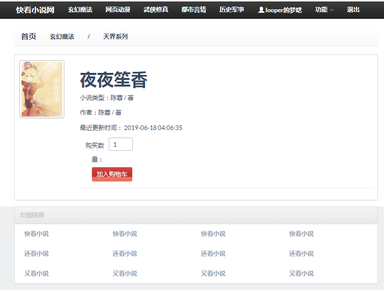
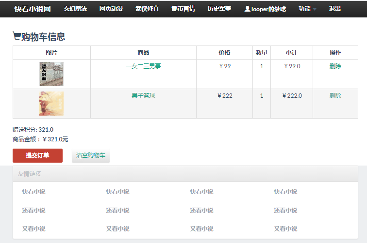
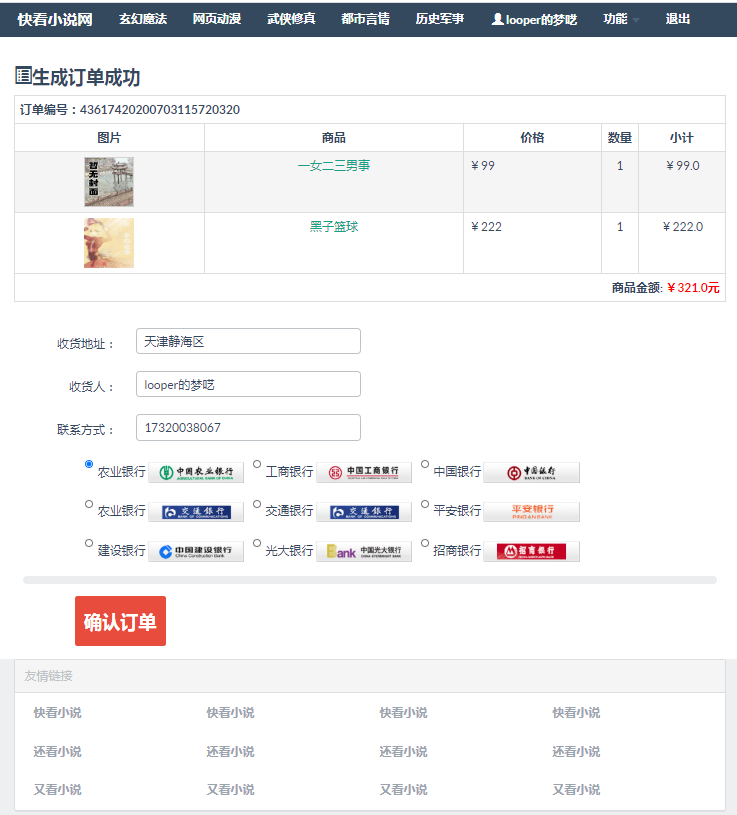
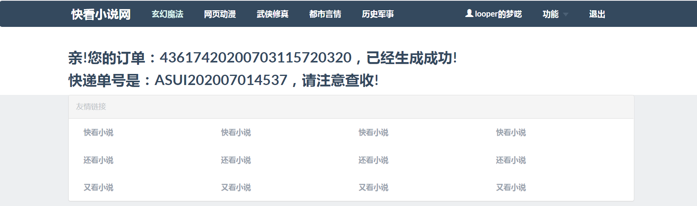
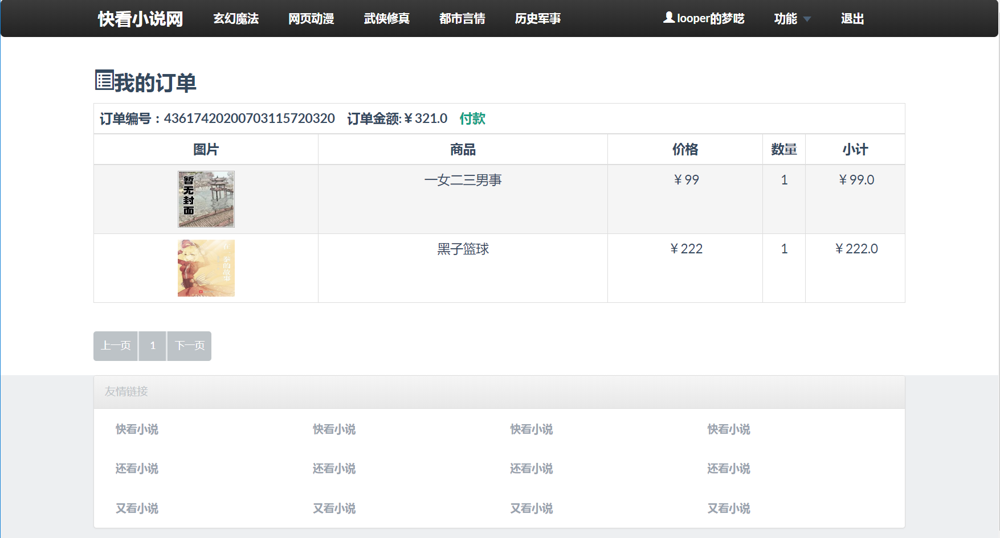
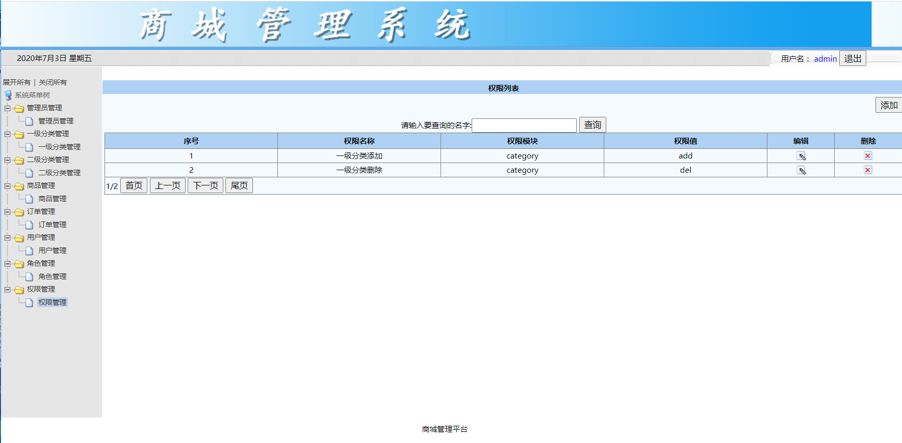

## :artificial_satellite:图书商城（快看小说）

### 1、项目背景

学习完 Spring、Spring MVC 和 MyBatis 之后，做了一个基于 SSM 的小型图书商城系统。

为这次的 SSM 学习做一次练习，以及将 Spring、Spring MVC 和 MyBatis 整合到一起，进行一次整体的练习。

 

### 2、项目使用的环境以及工具：

| 工具       | 详情                         |
| ---------- | ---------------------------- |
| 计算机系统 | Windows 10                   |
| 开发语言   | Java（jdk1.8.0_201版本）     |
| 开发工具   | Eclipse                      |
| 数据库     | MySql Server 5.5             |
| Maven      | 管理 SSM 项目中用到的 jar 包 |

 

### 3、项目技术：

#### 3.1、后端技术

##### Spring

* 整合各种框架

* Spring 框架充当父容器
* ContextLoaderListener 启动实例化 Spring 容器，管理 Bean（Service、Mapper、数据源、SqlSession、MapperScanConfiguror、Transaction）管理理业务层和数据访问层

 

##### SpringMVC

* Spring MVC 是子容器
* 实例化 Spring MVC 容器（是 Spring 容器的子容器，子容器的 Bean 可以访问父容器的 Bean）管理 Bean（Controller、视图解析器、CommonsMultipartResolver）
* 配置扫描基本包：`com.looper.controller` 管理控制层和视图层

 

##### MyBatis

* Mapper、POJO、配置文件、映射文件

 

#### 3.2、前端技术

Bootstrap：搭建前端页面的整体布局

Flat-UI：对 Bootstrap 框架的样式进行美化

bootstrapvalidator：使用封装的 Ajax 进行登录、注册的数据校验

 

### 4、项目功能点

#### 4.1、前台

* 登录

  使用 Ajax 进行局部刷新，时时校验用户信息是否正确；

* 注册
  1. 使用 Ajax 进行局部刷新，时时校验用户信息是否已经存在；
  2. 从 session 中获取验证码，进行验证
  3. 邮箱正确之后会给该邮箱发送验证码，用户通过点击邮件中的链接进行验证，从而激活账户

* 购物车
  1. 用户未登录时，在购物车提交订单会直接跳转到登录页面
  2. 用户未登录后，在购物车提交订单会直接跳转到订单页面
  3. 购物车里边的订单项，目前存放在 session 中，订单提交之后，会自动清空购物车

* 订单
  1. 订单产生之后，有四个状态：付款、等待发货、确认收货、完成订单
  2. 订单的分页

#### 4.2、后台

* 登录

  使用 Ajax 进行局部刷新，时时校验用户信息是否正确；

 

* 管理员管理

  增删改查、分页、角色分配

 

* 角色管理

  增删改查、分页、分配权限

 

* 权限管理

  增删改查、分页

 

* 一级分类管理

  增删改查、分页

 

* 二级分类管理

  增删改查、分页

 

* 商品管理

  增删改查、分页、文件上传（图书的封面）

 

* 订单管理

  增删改查、分页、查看订单的每一项、订单状态（等待付款、发货、等待收货、订单完成）

 

* 用户管理

  增删改查、分页

 

### 5、项目截图

 

 

 

 

 

 

 

 

 

 

 

 

