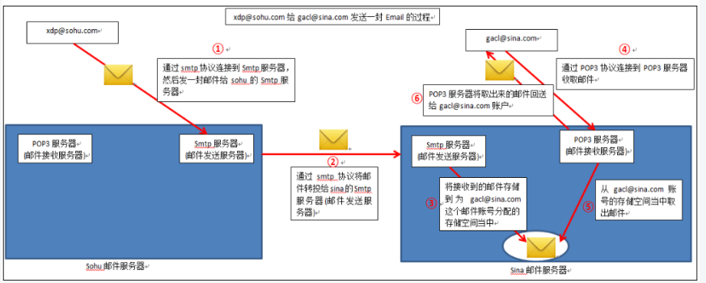

### 发送邮件激活账户

点击邮件的链接激活账户，只有激活账户之后才能登陆。

如果未激活会提示你到邮箱中接受邮件并激活账户

#### 发送邮件的原理：

1. 用户（looper@sohu.com）写好一封 Email 邮件发送到 sohu（搜狐）的 Smtp（Send mail transfer protocal 发送邮件传输协议）服务
   * 如果该邮件的收件人地址是自己管辖的账户，则就会将该邮件存放到自己的服务器，为该邮件分配的地址空间
   * 如果邮件的收件人地址不是自己管辖的账户，则就会通过收件人的地址去寻找对应的 Smtp 服务器
   * 将该邮件存放到自己的服务器，为该邮件分配的地址空间