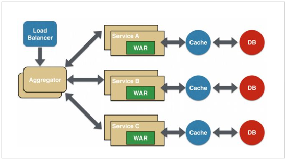

## 1、微服务

微服务架构是一种将单应用程序作为一套小型服务开发发的方法，每种应用程序都在自己的进程中运行，并与轻量级机制（HTTP 资源的 API）进行通讯。

这些服务是围绕业务功能构建的，可以通过全自动部署机制进行独立部署。

这些服务的集中化管理已经是最少的，它们可以用不同的编程语言编写，并使用不同的数据存储技术。

 

## 2、微服务特点

* 单一职责：微服务中每一个服务都对应唯一的业务能力，做到单一职责

* 微：微服务的服务拆分粒度很小，例如一个用户管理就可以作为一个服务。每个服务虽小，但五脏俱全。

* 面向服务：面向服务是说每个服务都要对外暴露服务接口 API 。并不关心服务的技术实现，做到与平台和语言无关，也不限定用什么技术实现，只要提供 Rest 的接口即可。

* 自治：自治是说服务间互相独立，互不干扰

  * 团队独立：每个服务都是一个独立的开发团队，人数不能过多。

  * 技术独立：因为是面向服务，提供 Rest 接口，使用什么技术没有别人干涉

  * 前后端分离：采用前后端分离开发，提供统一 Rest 接口，后端不用再为 PC、移动段开发不同接口

  * 数据库分离：每个服务都使用自己的数据源

  * 部署独立：服务间虽然有调用，但要做到服务重启不影响其它服务。有利于持续集成和持续交付。每个服务都是独立的组件，可复用，可替换，降低耦合，易维护。

 

