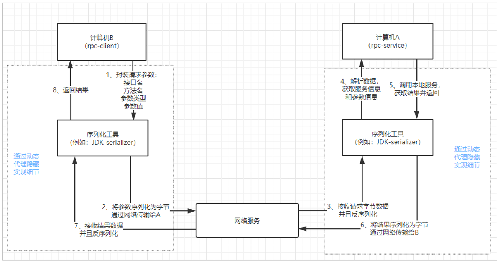
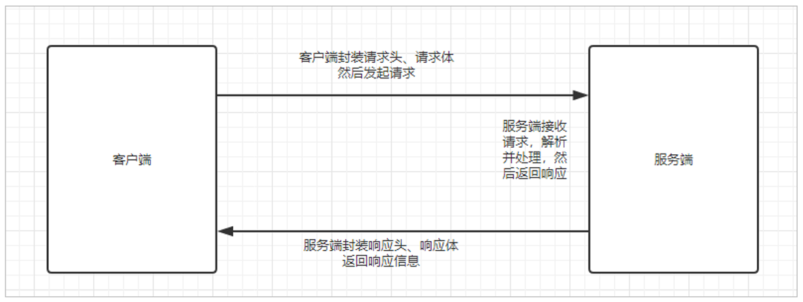

## 1、远程调用的方法

无论是微服务还是 SOA（Service-Oriented Architecture）面向服务的架构，都面临着服务间的远程调用

 

### 1.1、常见的远程调用方法：

1. RPC（Remote Procedure Call）远程过程调用：自定义数据格式，基于原生 TCP 通信，速度快，效率高。早期的 Webservice，现在热门的 Dubbo，都是 RPC 的典型。
2. HTTP：HTTP 其实是一种网络传输协议，基于 TCP，规定了数据传输的格式；现在客户端浏览器与服务端通信基本都是采用 HTTP 协议。也可以用来进行远程服务调用。缺点是消息封装臃肿；现在热门的Rest风格，就可以通过 HTTP 协议来实现。
   * HttpClient
   * OKHttp
   * URLConnection

 

#### 1.1.1、RPC

RPC，即 Remote Procedure Call（远程过程调用），是一个计算机通信协议。该协议允许运行于一台计算机的程序调用另一台计算机的子程序，而程序员无需额外地为这个交互作用编程。说得通俗一点就是：A 计算机提供一个服务，B 计算机可以像调用本地服务那样调用A计算机的服务。

* 采用何种网络通讯协议？

现在比较流行的RPC框架，都会采用TCP作为底层传输协议

* 数据传输的格式怎样？

两个程序进行通讯，必须约定好数据传输格式。就好比两个人聊天，要用同一种语言，否则无法沟通。所以，我们必须定义好请求和响应的格式。

另外，数据在网路中传输需要进行序列化，所以还需要约定统一的序列化的方式。

* 像调用本地服务一样调用远程服务 

如果仅仅是远程调用，还不算是，因为强调的是过程调用，调用的过程对用户而言是应该是透明的，用户不应该关心调用的细节，可以像调用本地服务一样调用远程服务。所以一定要对调用的过程进行封装

 

#### 1.1.2、Http

超文本传输协议，是一种应用层协议。规定了网络传输的请求格式、响应格式、资源定位和操作的方式等。但是底层采用什么网络传输协议，并没有规定，不过现在都是采用 TCP 协议作为底层传输协议。

说到这里，大家可能觉得，Http与RPC的远程调用非常像，都是按照某种规定好的数据格式进行网络通信，有请求，有响应。没错，在这点来看，两者非常相似，但是还是有一些细微差别。

* RPC 并没有规定数据传输格式，这个格式可以任意指定，不同的 RPC 协议，数据格式不一定相同。

* Http 中还定义了资源定位的路径，RPC 中并不需要

* 最重要的一点：RPC 需要满足像调用本地服务一样调用远程服务，也就是对调用过程在 API 层面进行封装。Http协议没有这样的要求，因此请求、响应等细节需要我们自己去实现。

* 优点：RPC 方式更加透明，对用户更方便。Http 方式更灵活，没有规定 API 和语言，跨语言、跨平台

* 缺点：RPC 方式需要在 API 层面进行封装，限制了开发的语言环境。

例如我们通过浏览器访问网站，就是通过 Http 协议。只不过浏览器把请求封装，发起请求以及接收响应，解析响应的事情都帮我们做了。如果是不通过浏览器，那么这些事情都需要自己去完成。

 

SpringBoot 封装了 Jackson，创建 ObjectMapper 对象就可以进行 JSON 格式的数据转换。

User 对象与 Json 串相互转换

~~~java
@Test
void testUserToJson() {
    User user = new User(101, "San", "123456");
    System.out.println(user);

    ObjectMapper objectMapper = new ObjectMapper();
    try {
        //user-->json
        String json = objectMapper.writeValueAsString(user);
        System.out.println(json);
        //json-->user
        User jsonToUser = objectMapper.readValue(json, User.class);
        System.out.println(jsonToUser);
    } catch (JsonProcessingException e) {
        e.printStackTrace();
    }
}
~~~

List 集合与 Json 串互相转换

~~~java
@Test
void testJsonToList() throws JsonProcessingException {
    User user1 = new User(101, "San", "123456");
    User user2 = new User(102, "Si", "123456");
    ObjectMapper objectMapper = new ObjectMapper();
    try {
        //List<User>-->json
        String jsonToList = objectMapper.writeValueAsString(Arrays.asList(user1,user2));
        //json-->List<User>
        List<User> list = objectMapper.readValue(jsonToList, new TypeReference<List<User>>() {});
        for (User user:list) {
            System.out.println(user);
        }
    } catch (JsonProcessingException e) {
        e.printStackTrace();
    }
}
~~~

