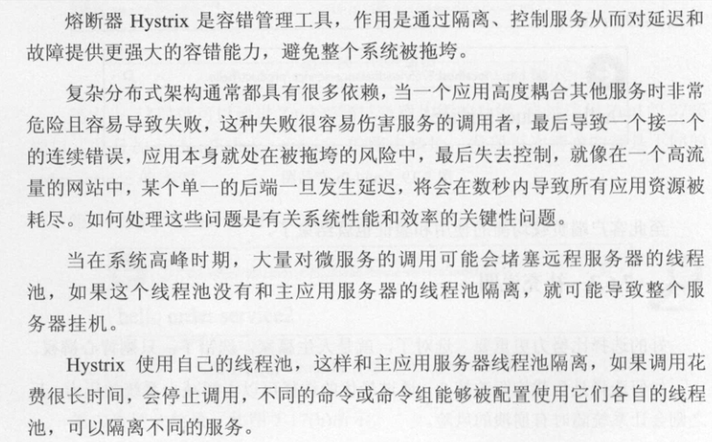
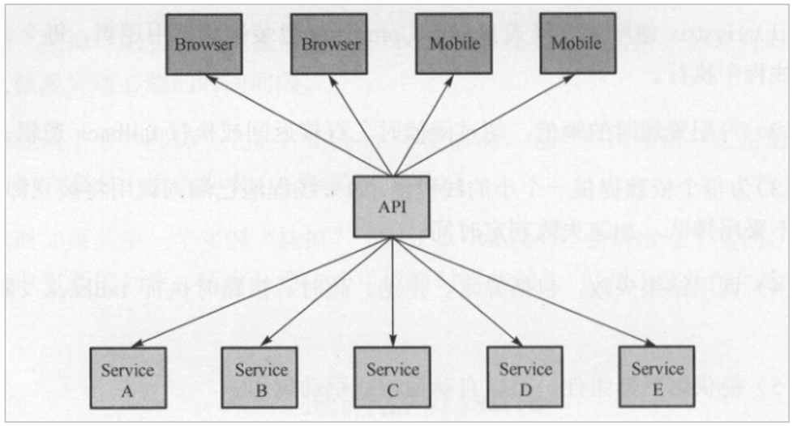
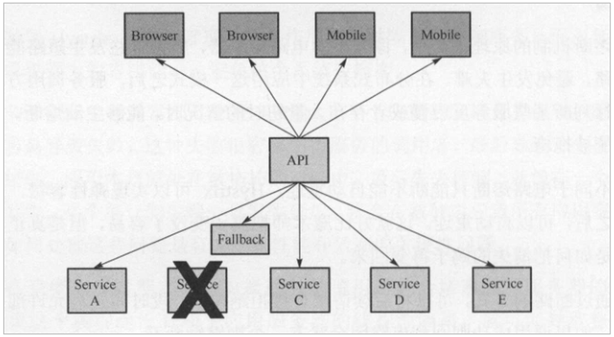

## 1、Hystix

Hystix 熔断器（豪猪）：是 Netflix 开源的一个延迟和容错库，用于隔离访问远程服务、第三方库，防止出现级联失败。

 

## 2、Hystix工作机制

正常情况下，客户端请求调用相应的服务 API 接口：

当发现有服务发生了故障、掉线等异常情况下，会进行 "回滚" 失败降级操作：

当服务繁忙时，如果服务出现异常，不是粗暴的直接报错，而是返回一个友好的提示，虽然拒绝了用户的访问，但是会返回一个结果，类似于排队效果。

例如在超市中，当购买肉类产品时，会主动帮忙完成切片、碎肉等操作，但遇过节时，就会取消这些额外的操作，这就是服务的降级操作。

系统特别繁忙时，一些次要服务暂时中断，优先保证主要服务的畅通，一切资源优先让给主要服务来使用，在双11、618时，京东天猫都会采用这样的策略。

 

## 3、Hystix实现

#### 3.1、添加依赖

Hystrix 是前端的处理组件，因而需要放置在 consumer 消费应用中，首先在项目中添加依赖：

~~~xml
<dependency>
    <groupId>org.springframework.cloud</groupId>
    <artifactId>spring-cloud-starter-netflix-hystrix</artifactId>
</dependency>
~~~

 

#### 3.2、添加注解

配置在启动类中，开启熔断：

~~~java
@EnableCircuitBreaker
~~~

 

#### 3.3、开启熔断

类似于之前的操作，在控制层代码中开启熔断设置：

~~~java
@RequestMapping("/findById")
@ResponseBody
@HystrixCommand(fallbackMethod = "fallback4Wait")
public Map<String,String> findById(int id) {
    System.out.println("this id = " + id);
    String url = "http://user-service/findById?id=" + id ;
    Map<String,String> result = restTemplate.getForObject(url, Map.class);
    return result ;
}

public Map<String,String> fallback4Wait(int id) {
    Map<String,String> result = new HashMap<>() ;
    result.put("result","400") ;
    return result ;
}
~~~

说明：@HystrixCommand(fallbackMethod="fallback4Wait")：声明一个失败回滚处理函数fallback4Wait，当 findById 执 行超时（默认是1000 毫秒），就会执行 fallback4Wait 函数，返回错误提示。  