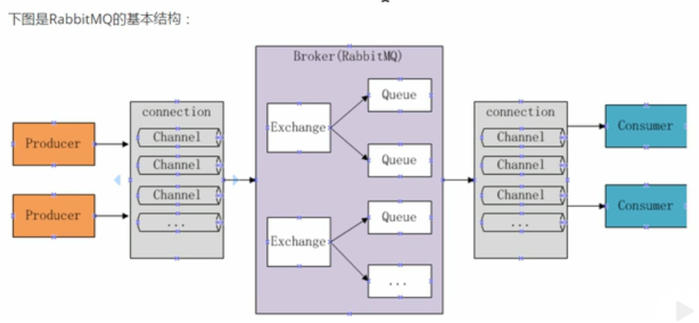

## 1、RabbitMQ

### 1.1、RabbitMQ定义

RabbitMQ 是一个开源的消息代理和队列服务器，通过普通协议在完全不同的应用之间共享数据.

RabbitMQ 是使用 Erlang 语言编写的，并且 RabbitMQ 是基于 AMQP（Advance Message Queuing Protocol）协议的。

 

### 1.2、AMQP

AMQP（Advance Message Queuing Protocol）一个提供统一消息服务的应用层标准高级消息队列协议，是应用层协议的一个开放标准，为面向消息的中间件设计。

 

### 1.3、RabbitMQ优点

1. 开源、性能优秀、稳定性保障
2. 提供可靠性消息投递模式（confirm）、返回模式（return）
3. 与 SpringAMQP 完美的整合，API 丰富
4. 集群模式丰富，表达式配置，HA 模式，镜像队列模型
5. 保证数据不丢失的前提下做到高可靠性、可用性

 

### 1.4、RabbitMQ的整体架构

 

### 1.5、RabbitMQ运行机制

#### 组成部分：

* Broker：消息队列服务进程，此进程包括两个部分：Exchange 和 Queue
* Exchange：消息队列交换机，按一定的规则将消息路由转发到某个队列，对消息进行过滤
* Queue：消息队列，存储消息的队列，消息到达队列并转发给指定的消费方
* Provider：消息生产者，将生产的消息发送到 MQ
* Consumer：消息消费者，接收 MQ 转发的消息

#### 消息发布接收流程：

1. 生产者和 Broker 建立 TCP 连接
2. 生产者和 Broker 建立通道（Channel）
3. 生产者通过通道消息发送 Broker，由 Exchange 将消息进行转发
4. Exchange 将消息转发到指定的队列（Queue）
5. 消费者监听消息队列，一有消息就接收消息

 

 

## 2、安装RabbitMQ

### 2.1、搜索拉取镜像

docker pull 镜像名

 

### 2.2、查看镜像

docker images

 

### 2.3、运行

docker run -d -p 5672:5672 -p 15672:15672 --name 名字 镜像id

 

### 2.4、查看进程

docker ps

 

### 2.5、服务

`http://ip:15672/ guest/guest`

 