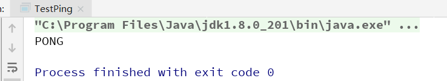
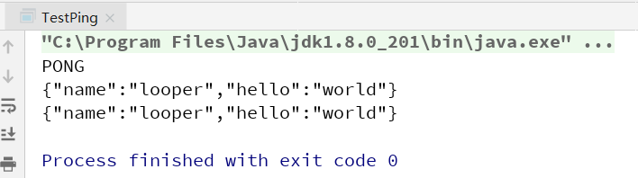

## Jedis

### 什么是Jedis

使用 Java 操作 Redis。

Jedis 是 Redis 官方推荐的 Java 连接开发工具，使用 Java 操作 Redis 的中间件。

 

### 测试Jedis

1、在 Maven 项目中导入需要的 Maven 依赖（Jedis 和 FastJSON）

~~~xml
<dependencies>
  	<!--Jedis-->
    <dependency>
        <groupId>redis.clients</groupId>
        <artifactId>jedis</artifactId>
        <version>3.2.0</version>
    </dependency>
    <!--fastjson-->
    <dependency>
        <groupId>com.alibaba</groupId>
        <artifactId>fastjson</artifactId>
        <version>1.2.62</version>
    </dependency>
</dependencies>
~~~

 

2、编码测试连接

~~~java
public class TestPing {
    public static void main(String[] args) {
        // 1、new Jedis 对象即可
        Jedis jedis = new Jedis("127.0.0.1",6379);
        // 2、Jedis 所有的方法就是之前的指令
        System.out.println(jedis.ping());
    }
}
~~~

 

3、测试

 

Java 的 API 操作都和 redis 的命令行操作差不多，所以多熟悉 Redis 命令即可。

### 事务操作

~~~java
package com.looper;

import com.alibaba.fastjson.JSONObject;
import redis.clients.jedis.Jedis;
import redis.clients.jedis.Transaction;

public class TestPing {
    public static void main(String[] args) {
        // 1、new Jedis 对象即可
        Jedis jedis = new Jedis("127.0.0.1",6379);
        // 2、Jedis 所有的方法就是之前的指令
        System.out.println(jedis.ping());

        JSONObject jsonObject = new JSONObject();
        jsonObject.put("hello","world");
        jsonObject.put("name","looper");
        //开启事务
        Transaction transaction = jedis.multi();
        String result = jsonObject.toJSONString();
        try {
            transaction.set("user1",result);
            transaction.set("user2",result);
            transaction.exec();
        } catch (Exception e) {
            transaction.discard();// 放弃事务
            e.printStackTrace();
        } finally {
            System.out.println(jedis.get("user1"));
            System.out.println(jedis.get("user2"));
            transaction.close();// 关闭连接
        }
    }
}
~~~

