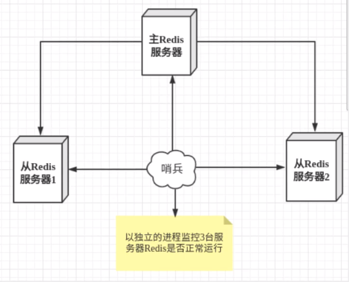

## 哨兵模式

Redis 的主从复制中，主机发生宕机或者断开连接之后，需要手动把一台从机切换为主机，这就需要人工干预，费时费力，还会造成一段时间内服务不可用。因此我们会优先考虑哨兵模式。Redis 从2.8 开始正式提供了 Sentinel（哨兵）来解决这个问题。

Redis 的主从复制中，主机发生宕机或者断开连接之后，会自动的在从机中选举一个新的主机出来，以便能够很好的继续提供读写服务。

哨兵模式会监控后台主机是否有故障，如果有故障了，则会根据投票数自动将从库切换为主库。

哨兵模式是一种特殊的模式，首先 Redis 提供了哨兵的命令，哨兵是一个独立的进程，作为进程，他会独立运行。其原理是哨兵通过发送命令，等待 Redis 服务器响应，从而监控运行多个 Redis 实例。

