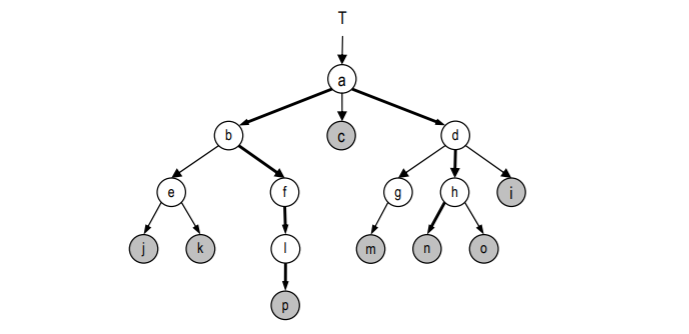
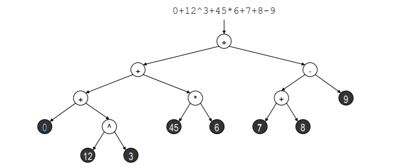
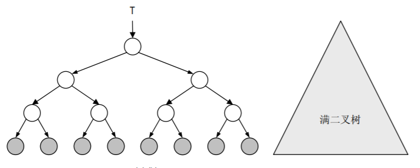
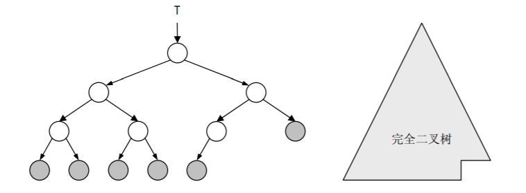

# 1、树

在数据结构中可以划分为两种类型：基于数组的实现与基于链表的实现。 

数组特点：遍历快，增删慢。

链表特点：遍历慢，增删快。

属于线性结构，而树的元素之间并不存天然的线性关系，因此树被称为非线性关系。

当给树附加上某种约束的时候，树中的元素之间也可以确定某种线性次序，因此树也称为半线性关系。

 

就其内部组成而言，树是一种分层结构。

树结构之所以在算法理论与实际应用中始终都扮演着 最关键的角色，并且有着不计其数的变种，其实并不足为怪⎯⎯层次化的概念几乎蕴含于所有事物 之中，乃是它们的本质属性之一。

从文件系统、Internet 的域名系统、数据库系统到人类社会系统， 层次结构无所不在。

 

## 1.1、术语以及性质

在树结构中，每个节点的深度都是一个非负整数

深度为 0 的节点有且仅有一个，称作树根（Root）

 

 

对于深度为 k (k≥1) 的每个节点 u，都**有且仅有**一个深度为 k-1 的节点 v 与之对应，称作 u 的父亲（Parent）或父节点。（一个子节点只能有一个父节点，但是一个父节点可以有多个子节点，同一节点的多个子节点互称 "兄弟"）

若节点 v 是节点 u 的父亲，则 u 称作 v 的孩子（Child）或子节点，并在二者之间建立一条树边（Edge） ，这条边的方向是由父节点指向子节点的

 

树中所有节点的最大深度，称作树的深度或高度

树中节点的数目，总是等于边数加一（就渐进复杂度而言，树中边的总数与节点的总数相当。正是基于这一事实，在对涉及树结构的有关算法做复杂度分析时，我们可以用节点的数目来度量树结构本身的存储空间复杂度）

 

度：任一节点的孩子数目，称作它的“度”（Degree）

 

内部节点：至少拥有一个孩子的节点称作“内部节点”（Internal node）

 

外部节点：没有任何孩子的节点则称作 “外部节点”（External node）或“叶子”（Leaf）

 

路径：由树中 k+1 节点通过树边首尾衔接而构成的序列 { (v0, v1), (v1, v2), …, (vk-1, vk) | k ≥ 0}，称作树中长度为 k 的一条路径（Path），需要注意的是由单个节点、零条边构成的路径也是合法的，其长度为 0

 

树中任何两个节点之间都存在唯一的一条路径

 

若 v 是 u 的父亲，则 depth(v) + 1 = depth(u)

 

从树根通往任一节点的路径长度，恰好等于该节点的深度。

 

每个节点都是自己的“祖先”（Ancestor），也是自己的“后代”（Descendent）

* 若 v 是 u 的父节点的祖先，则 v 也是 u 的祖先（祖先的祖先也是祖先）
* 若 u 的父节点是 v 的后代，则 u 也是 v 的后代（后代的后代也是后代）

 

除节点本身以外的祖先（后代），称作真祖先（后代）。

节点 a 和 b 是 f 的真祖先，而 l 和 p 都是 f 的真后代，同时 f 既是自己的祖先也是自己的后代

根节点a是所有节点的祖先

 

任一节点 v 的深度，等于其真祖先的数目

任一节点 v 的祖先，在每一深度上最多只有一个

 

树 T 中每一节点 v 的所有后代也构成一棵树，称作 T 的“以 v 为根的子树（Subtree）”

需要特别指出的是，空节点（null）本身也构成一棵树，称作“空树”（Empty tree）

空树虽然不含任何节点，但却是任何树的（平凡）子树

 

若子树 v 的深度（高度）为 h，则称 v 的高度为 h，记作 height(v) = h

特别地，根节点的高度就是整棵树的深度（高度）

对于叶子节点 u 的任何祖先 v，必有 depth(v) + height(v) ≥ depth(u)

 

在树 T 中，若在每个节点的所有孩子之间都可以定义某一线性次序，则称 T 为一棵“有序树（Ordered tree）”

 

每个内部节点均为 m 度（任意节点的孩子的个数）的有序树，称作 m 叉树；每个节点均不超过 2 度的有序树，称作二叉树（Binary tree）；二叉树是最简单的非平凡 m 叉树。

 

在二叉树中，每个节点的孩子可以用左、右区分，分别称作左孩子和右孩子；如果左、右孩子 同时存在，则左孩子的次序优先于右孩子；以节点 v 的左（右）孩子为根的子树，称作 v 的左（右）子树；不含 1 度节点的二叉树，称作真二叉树（Proper bina ry tree ），否则称作非真二叉树。

 

 

 

若二叉树 T 中所有叶子的深度完全相同，则称之为满二叉树（Full binary tree）

高度为 h 的二叉树是满的，当且仅当它拥有 2h匹叶子、2h+1-1 个节点

 

 

若在一棵满二叉树中，从最右侧起将相邻的若干匹叶子节点摘除掉，则得到的二叉树称 作完全二叉树（Complete binary tree）

由 n 个节点构成的完全二叉树，高度 h = log⎣2⎦n

在由固定数目的节点所组成的所有二叉树中，完全二叉树的高度最低

